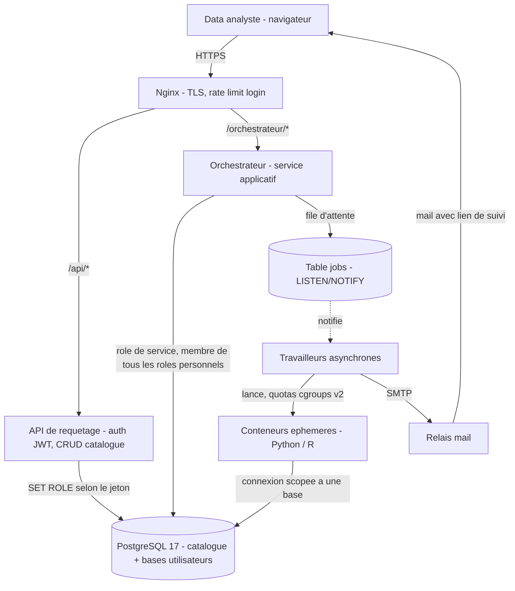
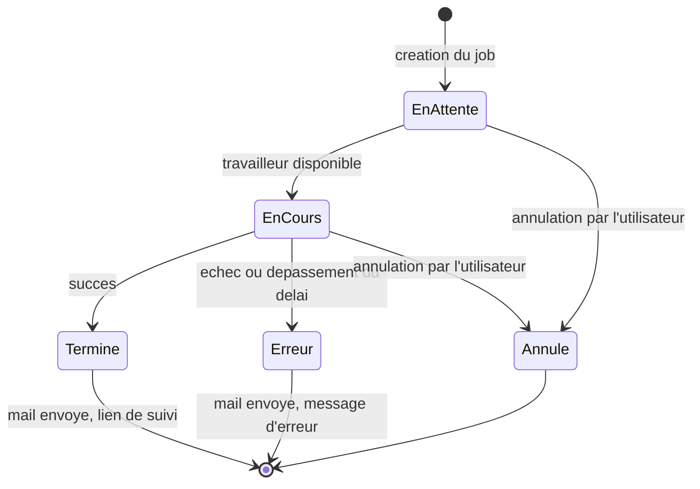

<!-- title: SILLON — Cahier des charges -->

# SILLON

### Système d'Interrogation Local et Libre d'Outils Numériques

**Cahier des charges fonctionnel et technique**

| Champ | Valeur |
|---|---|
| Version | 1.4 |
| Date | 12 août 2026 |
| Statut | Avant-projet — en cours de validation |
| Périmètre | Direction locale — hors lac de données national |
| Stack technique | PostgreSQL 17, PostgREST, Nginx, DSFR — architecture sans framework applicatif lourd côté front |
| Système d'exploitation | Debian 13 (Trixie) |

---

## Sommaire

1. [Contexte et objectifs](#1-contexte-et-objectifs)
2. [Périmètre fonctionnel](#2-périmètre-fonctionnel)
3. [Utilisateurs et droits](#3-utilisateurs-et-droits)
4. [Architecture technique](#4-architecture-technique)
5. [Spécifications fonctionnelles](#5-spécifications-fonctionnelles)
6. [Modèle de données](#6-modèle-de-données-catalogue-applicatif)
7. [Performances et indexation](#7-performances-postgresql-et-indexation)
8. [Sécurité](#8-sécurité)
9. [File d'attente et traitements asynchrones](#9-file-dattente-et-traitements-asynchrones)
10. [Notifications](#10-notifications)
11. [Quotas et limites](#11-quotas-et-limites)
12. [Système d'exploitation et packaging](#12-système-dexploitation-et-packaging)
13. [Exigences non fonctionnelles](#13-exigences-non-fonctionnelles)
14. [Phasage](#14-phasage)
15. [Annexes](#15-annexes)

---

## 1. Contexte et objectifs

### 1.1 Contexte

La direction dispose aujourd'hui d'un accès à des outils nationaux connectés au lac de données de l'État, mais ces outils ne couvrent que les données déjà remontées et standardisées au niveau national. Une part significative des données produites et exploitées localement — extractions métier, référentiels internes, fichiers de suivi, données de gestion propres à la direction — n'a pas vocation à transiter par le national, ou n'y est pas encore intégrée.

Les data analystes de la direction ont besoin d'un outil autonome pour importer, structurer, interroger et traiter ces données locales, sans dépendre d'un circuit national et sans lui être subordonnés. SILLON répond à ce besoin : une plateforme locale, portée par la direction elle-même, qui donne à ses data analystes la liberté d'intégrer et d'exploiter leurs propres jeux de données, à leur rythme.

L'architecture retenue est volontairement sobre : un front-end web utilisant le Système de Design de l'État (DSFR) pour l'ergonomie et l'accessibilité, une base de données PostgreSQL qui porte à la fois les données métier et la sécurité applicative (authentification, droits d'accès), et un unique composant serveur nouveau — l'orchestrateur — chargé de tout ce que la base de données ne peut pas faire seule : création de bases à la demande, mise en file des traitements longs, exécution isolée de code déposé par les utilisateurs.

### 1.2 Objectifs

- Permettre à un data analyste habilité d'importer un fichier CSV et de le transformer en table PostgreSQL correctement typée, sans écrire de SQL.
- Donner accès à une base de travail personnelle, qui s'enrichit au fil des imports.
- Permettre l'exécution de requêtes SQL libres sur cette base, avec export des résultats en CSV UTF-8.
- Permettre le dépôt et l'exécution de scripts Python ou R côté serveur, pour des traitements que le SQL seul ne couvre pas (statistiques, data-visualisation, modèles).
- Absorber des volumétries élevées sans bloquer l'interface : les traitements longs passent par une file d'attente, avec notification par mail à l'utilisateur une fois le résultat prêt.
- Permettre à un analyste de partager sa base avec des collègues, sans dupliquer les données.
- Rester administrable par la direction elle-même (création des comptes, attribution des droits), sans dépendance à un service national.

### 1.3 Ce que SILLON n'est pas

- SILLON n'est **pas** une réplication ou une synchronisation du lac de données national : aucune donnée n'y est poussée ni tirée automatiquement depuis le national dans cette version.
- SILLON n'est pas un outil de diffusion publique : les bases créées restent internes à la direction et à ses utilisateurs habilités.
- SILLON ne remplace pas un entrepôt de données de production : c'est un outil d'analyse et d'exploration, pas un système transactionnel.

---

## 2. Périmètre fonctionnel

| Fonction | Description | Statut |
|---|---|---|
| Import CSV avec qualification des colonnes | Dépôt d'un fichier, proposition de type par colonne, création de table | Dans le périmètre |
| Base personnelle par agent | Une base par agent, créée au premier import, enrichie ensuite | Dans le périmètre |
| Sélection d'une base de travail | Onglet listant les bases possédées et les bases partagées | Dans le périmètre |
| Requêtes SQL libres | Éditeur SQL, exécution sur la base sélectionnée, export CSV UTF-8 | Dans le périmètre |
| Dépôt de scripts Python / R | Exécution côté serveur, en environnement isolé | Dans le périmètre |
| File d'attente et notification mail | Traitement asynchrone des jobs longs, mail avec lien vers le résultat | Dans le périmètre |
| Partage de bases entre utilisateurs | Un agent autorise un autre utilisateur à interroger sa base | Dans le périmètre |
| Administration des comptes et des droits | Création des comptes, attribution des rôles, quotas | Dans le périmètre |
| Synchronisation avec le lac de données national | — | Hors périmètre (v1) |
| Fédération d'identité / SSO ministériel | — | Hors périmètre (v1) |
| Visualisation de données intégrée (tableaux de bord) | Les scripts Python/R peuvent produire des graphiques en sortie de job, mais aucun module de dashboard natif n'est prévu | Hors périmètre (v1) |
| Sauvegarde et plan de reprise des bases de données | La protection contre la perte de données (panne disque, erreur de manipulation) relève de l'infrastructure d'hébergement existante de la direction, pas de l'application elle-même | Hors périmètre |

---

## 3. Utilisateurs et droits

Trois profils, portés nativement par des rôles PostgreSQL plutôt que par une table de permissions applicative séparée.

| Action | Lecteur | Agent | Administrateur |
|---|:---:|:---:|:---:|
| Se connecter et consulter son profil | ✅ | ✅ | ✅ |
| Consulter les bases qui lui sont accessibles | ✅ | ✅ | ✅ |
| Interroger (SELECT) une base accessible, exporter en CSV | ✅ | ✅ | ✅ |
| Importer un CSV / créer sa base personnelle | ❌ | ✅ | ❌ (pas d'usage métier direct) |
| Créer / supprimer des tables dans sa propre base | ❌ | ✅ | ❌ |
| Supprimer sa propre base | ❌ | ✅ | ❌ |
| Partager sa base avec un autre utilisateur | ❌ | ✅ (sur ses propres bases) | ❌ |
| Déposer et exécuter un script Python/R | ❌ | ✅ (sur ses bases, ou sur une base partagée si l'accès script est explicitement accordé) | ❌ |
| Créer un compte, attribuer un rôle | ❌ | ❌ | ✅ |
| Réinitialiser un mot de passe, désactiver un compte | ❌ | ❌ | ✅ |
| Consulter le journal d'audit | ❌ | ❌ | ✅ |
| Modifier les quotas globaux ou par utilisateur | ❌ | ❌ | ✅ |

**Principe de fonctionnement** : chaque utilisateur (lecteur ou agent) possède un rôle PostgreSQL personnel, créé par l'administrateur à la création du compte. Ce rôle est ce qui porte réellement les droits — un agent est propriétaire (`OWNER`) de sa base, ce qui lui donne nativement le droit d'y créer des tables et d'accorder des accès, sans passer par une couche de permissions applicative séparée.

**Cycle de vie d'un compte** : un compte créé par l'administrateur est immédiatement actif. Sa désactivation est immédiate et vérifiée à chaque requête, indépendamment de la validité de la session en cours (voir §8.2). Un changement de profil (par exemple lecteur promu agent) prend effet à la prochaine connexion.

---

## 4. Architecture technique

### 4.1 Vue d'ensemble

### 4.2 Composants

| Composant | Rôle | Justification |
|---|---|---|
| Nginx | Terminaison TLS, reverse proxy, limitation de débit sur l'authentification | Seul point d'entrée exposé publiquement ; réduit la surface d'attaque des composants internes |
| API de requêtage (PostgREST) | Authentification par jeton, opérations CRUD sur le catalogue applicatif (utilisateurs, bases, partages, jobs, audit) | Expose directement le schéma du catalogue sans code applicatif intermédiaire à maintenir ni à auditer pour ces opérations standards |
| PostgreSQL 17 | Moteur d'authentification, contrôle d'accès natif, hébergement du catalogue et de toutes les bases utilisateurs | La sécurité (qui peut voir quoi) est portée par le moteur de base de données lui-même plutôt que reconstruite en couche applicative — élimine une classe entière de vulnérabilités liées à un contrôle d'accès applicatif incomplet |
| Orchestrateur | Composant central nouveau : création/suppression de bases, exécution des requêtes SQL libres, gestion de la file d'attente, lancement des conteneurs, envoi des mails | Seul composant à qui il faut confier des opérations que ni le reverse proxy ni l'API de requêtage ne peuvent réaliser (opérations de niveau cluster, exécution de code) |
| Conteneurs éphémères | Isolation des scripts Python/R : un conteneur par job, image figée, quotas CPU/RAM/temps, pas d'accès réseau sortant hors connexion à la base cible | Isole physiquement l'exécution de code déposé par un utilisateur du reste du système |
| Anti-bruteforce périmétrique | Blocage automatique d'une adresse IP après plusieurs échecs de connexion rapprochés | Complète la limitation de débit en ajoutant une pénalité progressive |
| Relais mail | Envoi des notifications de fin de traitement | Canal de notification asynchrone découplé de l'interface web |
| DSFR | Charte graphique, composants d'interface et accessibilité | Cohérence visuelle et conformité RGAA sans développement de composants d'interface propriétaires |

### 4.3 Authentification et bascule de rôle

À la connexion, l'utilisateur soumet son identifiant et son mot de passe. Le mot de passe est vérifié par comparaison avec le hachage stocké (voir §8.1). Si la vérification réussit, un jeton signé est généré, contenant a minima : l'identité de l'utilisateur, son profil (lecteur / agent / administrateur), le nom de son rôle PostgreSQL personnel, et une date d'expiration. Ce jeton est déposé dans un cookie inaccessible au JavaScript de la page (voir §8.2), qui sera automatiquement renvoyé par le navigateur à chaque requête suivante.

À chaque requête, le composant qui reçoit le jeton (API de requêtage ou orchestrateur) bascule sa connexion à la base de données vers le rôle PostgreSQL personnel indiqué dans le jeton, avant d'exécuter la moindre opération. Cette bascule est possible parce que le rôle de service utilisé par ces composants a été rendu membre de chaque rôle personnel au moment de la création du compte correspondant — un rôle de service ne peut techniquement basculer que vers les rôles dont il est membre, ce qui borne strictement ce qu'un composant compromis pourrait usurper.

Concrètement, chaque compte créé par l'administrateur déclenche automatiquement :
1. La création d'un rôle PostgreSQL personnel, sans droit de connexion directe au serveur (le rôle ne sert qu'à porter des permissions, jamais à se connecter en direct).
2. Son rattachement au rôle de service applicatif.
3. Son rattachement au profil correspondant (lecteur / agent / administrateur) pour hériter des droits de base associés à ce profil.

---

## 5. Spécifications fonctionnelles

### 5.1 Onglet « Import »

**Déroulé fonctionnel**

1. Dépôt du fichier CSV (glisser-déposer ou sélection). Détection automatique de l'encodage source (UTF-8, Latin-1/Windows-1252 — fréquent sur les exports administratifs) et du délimiteur (`,` `;` `\t`), avec conversion systématique en UTF-8 à l'enregistrement.
2. Détection de la ligne d'en-tête (première ligne par défaut), avec option pour la désactiver si le fichier n'en contient pas — dans ce cas, des noms de colonnes génériques sont proposés et modifiables.
3. Aperçu des 50 premières lignes, colonne par colonne, avec un type détecté automatiquement (Texte, Entier, Décimal, Date, Date/Heure, Booléen, JSON) que l'utilisateur peut corriger colonne par colonne.
4. Avant validation finale, un contrôle de cohérence parcourt l'ensemble du fichier (pas seulement l'aperçu) et signale les lignes en anomalie par rapport au type choisi (par exemple une colonne déclarée Entier contenant une valeur non numérique à la ligne 452), avec le choix pour l'utilisateur de corriger le typage, d'exclure les lignes en anomalie, ou d'annuler l'import.
5. Choix du mode de représentation des valeurs manquantes (chaîne vide, `NA`, `-`, etc., configurable), converties en `NULL` à l'import.
6. Choix du nom de la table : pré-rempli avec le nom du fichier, normalisé automatiquement selon les règles d'identifiants PostgreSQL (minuscules, sans accent, 63 caractères maximum, caractères spéciaux remplacés). En cas de collision avec une table existante, l'application propose soit de renommer, soit de remplacer le contenu de la table existante (avec confirmation explicite).
7. Validation : si le fichier est petit, la table est créée et remplie immédiatement, avec retour visible en quelques secondes ; au-delà du seuil de taille défini en §11, l'import est placé en file d'attente et l'utilisateur est notifié par mail à la fin.
8. Si c'est le premier import de l'utilisateur, sa base personnelle est créée avant la table (job de création de base, transparent pour l'utilisateur).
9. Chaque import réussi ou échoué est journalisé (voir §8.12), avec le nombre de lignes importées.

L'utilisateur peut revenir en arrière à toute étape de l'assistant sans avoir à re-déposer le fichier.

### 5.2 Onglet « Bases »

Liste en deux sections :
- **Mes bases** (profil agent) : la base personnelle, sa taille, la liste des tables, les utilisateurs avec qui elle est partagée.
- **Bases partagées avec moi** : bases d'autres agents auxquelles l'utilisateur a été autorisé, avec le nom du propriétaire.

La base personnelle est sélectionnée automatiquement comme base active dès la connexion si elle existe déjà, pour ne jamais imposer une sélection manuelle systématique sur le cas le plus courant — sans jamais écraser un choix explicite fait ensuite par l'utilisateur (une base partagée, par exemple) au fil des rafraîchissements de la session.

**Fiche d'une table** : nombre de lignes, liste des colonnes et de leurs types, date et taille du dernier import, avec un aperçu des premières lignes.

**Actions disponibles**

- Sélectionner une base pour travailler dessus (active le contexte des onglets Travaux et Scripts).
- *(Propriétaire uniquement)* Gérer le partage : ajouter ou retirer un bénéficiaire par recherche d'email, avec une case séparée « autoriser l'exécution de scripts », désactivée par défaut — le partage donne un accès en lecture seule aux données ; l'exécution de code reste une autorisation distincte, accordée explicitement.
- *(Propriétaire uniquement)* Supprimer une table : confirmation rappelant le nombre de lignes concernées.
- *(Propriétaire uniquement)* Supprimer la base entière : action irréversible, confirmation renforcée (saisie du nom de la base à supprimer avant validation).

### 5.3 Onglet « Travaux »

- Éditeur SQL en texte libre, avec coloration syntaxique et auto-complétion des noms de tables et de colonnes de la base sélectionnée.
- Exécution avec le rôle personnel de l'utilisateur : les droits appliqués sont exactement ceux que cet utilisateur aurait en se connectant directement à la base.
- Détection du type de requête : une requête de lecture s'exécute directement ; une requête de modification de structure ou de données (`INSERT`, `UPDATE`, `DELETE`, `CREATE`, `DROP`, `ALTER`…) déclenche une demande de confirmation explicite avant exécution.
- Résultat affiché à l'écran, paginé (limité à un nombre de lignes raisonnable pour l'affichage, avec bandeau indiquant que le résultat est tronqué à l'écran si le total est supérieur).
- Export du résultat complet en CSV, encodage UTF-8, quel que soit le nombre de lignes retourné par la requête (le rendu à l'écran et l'export ne partagent pas la même limite).
- Historique persistant des requêtes exécutées par l'utilisateur, avec horodatage, durée d'exécution et possibilité de relecture ou de réexécution.
- Requêtes enregistrées : possibilité de nommer et conserver une requête pour la retrouver ultérieurement.
- Toute requête dépassant le délai maximal défini en §11 est automatiquement interrompue ; l'utilisateur est invité à basculer ses exécutions suivantes de longue durée en job asynchrone, avec notification par mail à la fin.

### 5.4 Onglet « Scripts »

- Dépôt d'un fichier `.py` ou `.R`, taille maximale définie en §11.
- Visualisation et modification du contenu avant lancement (fichier déposé ou script écrit directement dans l'interface) : le fichier n'est jamais envoyé tel quel sans passer par cette étape de relecture. Sans fichier choisi, le squelette de connexion commun (variables d'environnement §5.4 ci-dessous) est pré-rempli pour le langage choisi, afin de ne jamais partir d'une page blanche sur la partie identique d'un script à l'autre.
- Sélection de la base cible parmi celles accessibles à l'utilisateur avec exécution de script autorisée.
- Contrat d'exécution : le script reçoit une chaîne de connexion à la base cible via une variable d'environnement dédiée, scopée au rôle de l'utilisateur qui soumet le job — jamais d'identifiants génériques ou élevés. Un répertoire de sortie conventionnel est mis à disposition du script pour y déposer les fichiers destinés à être récupérés par l'utilisateur (résultats, graphiques, exports).
- La liste des librairies disponibles dans l'environnement d'exécution est affichée dans l'interface avant le dépôt, pour éviter les échecs liés à une dépendance manquante.
- Lancement : le job est systématiquement mis en file d'attente (voir §9), quelle que soit sa durée estimée.
- Pendant l'exécution, les journaux (sortie standard et erreurs) sont consultables depuis l'onglet Suivi, rafraîchis périodiquement — pas seulement disponibles une fois le job terminé.
- À la fin : les journaux complets et les fichiers produits sont packagés et rendus disponibles au téléchargement.
- Historique des exécutions précédentes, avec possibilité de retélécharger un résultat déjà produit tant que la politique de rétention (§8.9) le permet.

### 5.5 Onglet « Suivi »

- Vue consolidée de tous les jobs de l'utilisateur, tous types confondus (imports, requêtes longues, scripts, créations ou suppressions de base), filtrable par type et par statut, rafraîchie automatiquement toutes les 10 secondes tant que cet onglet reste affiché, paginée par 10 traitements — un rafraîchissement (manuel ou automatique) ne modifie jamais la page consultée ni ne referme un panneau Journal ou Aperçus déjà ouvert.
- Pour un dépôt de script ou un import CSV : nom du fichier concerné affiché en colonne Détail, pour distinguer d'un coup d'œil plusieurs traitements du même type dans la liste.
- Statuts affichés : en attente, en cours, terminé, erreur, annulé — avec, pour un job en attente, une estimation de sa position dans la file.
- Annulation possible tant que le job est en attente ou en cours.
- Pour un job en erreur : un message technique (pour investigation) et un message utilisateur reformulé de façon compréhensible.
- Lien de téléchargement du résultat une fois le job terminé, soumis à authentification (voir §8.10).
- Pour un job de script terminé : prévisualisation directe, dans le navigateur, des fichiers de résultat qui s'y prêtent — images (graphiques), tableaux CSV et diagrammes Mermaid (fichier `.mmd`) — sans obliger l'utilisateur à télécharger l'archive complète pour les consulter. Cas particulier des diagrammes Mermaid : le bac à sable d'exécution ne peut pas rendre l'image lui-même (aucun moteur de rendu Node/Chromium dans `sillon-image-execution`, §8.7), un script s'y limite donc à écrire le texte Mermaid ; SILLON le rend côté client (bibliothèque JavaScript vendorisée, aucun appel externe).

### 5.6 Panneau Administration

- Gestion des comptes : création (email, profil initial, mot de passe provisoire), recherche par email ou nom, modification du profil, réinitialisation de mot de passe, désactivation.
- Tableau de bord des quotas : consommation par utilisateur (espace disque occupé, jobs en cours), avec signalement visuel à l'approche d'un seuil.
- Vue d'ensemble des bases existantes tous utilisateurs confondus, à des fins de supervision (métadonnées uniquement — taille, date de création, propriétaire — sans accès aux données elles-mêmes).
- Consultation du journal d'audit, avec filtre par utilisateur, par type d'action et par période, et export de la liste des comptes et de leurs droits.
- Réglage des quotas globaux et, si besoin, dérogations par utilisateur.

### 5.7 Onglet « Carto »

- Accessible à tous les utilisateurs (pas de restriction de profil), pour produire manuellement une carte choroplèthe à partir de données par code INSEE, sans passer par un script.
- Source des données : dépôt d'un fichier CSV local, ou réutilisation du résultat de la dernière requête de lecture exécutée dans l'onglet Travaux — au choix, sans avoir à réimporter les données dans une base.
- Échelles disponibles, avec sélection en cascade (région puis département puis EPCI ou commune selon l'échelle) : monde, France métropolitaine, région, département, EPCI, commune.
- Colonne « code INSEE » et colonne de valeur choisies explicitement par l'utilisateur parmi les colonnes du jeu de données ; la colonne choisie comme code INSEE est systématiquement exclue des colonnes proposables comme valeur (elle ne représente jamais une grandeur à cartographier) ; mode de calcul : somme brute, part en pourcentage, ratio entre deux colonnes, ou évolution entre deux colonnes.
- Étiquettes optionnelles (nom, valeur, ou les deux) avec répartition automatique évitant les recouvrements ; réglage fin une fois activées : taille, filtre par nom ou code (liste de valeurs), filtre avancé sur une autre colonne agrégée (opérateur de comparaison et seuil), et deux curseurs pilotant la répartition automatique (aération, répulsion).
- Coloration : palette par défaut (Bleu France), deux dégradés divergents prédéfinis, ou dégradé personnalisé à deux couleurs choisies dans un nuancier à deux niveaux (une teinte du système de design de l'État, puis une nuance de cette teinte, de la plus claire à la plus soutenue) pour chacune des deux bornes du dégradé.
- Légende de colorimétrie optionnelle.
- Export de la carte en image PNG.

### 5.8 Onglet « Graphiques »

- Accessible à tous les utilisateurs, pour produire manuellement un graphique à partir de données tabulaires, sans passer par un script.
- Même mécanisme de source de données qu'en §5.7 (CSV déposé ou résultat de la dernière requête SQL) : première colonne interprétée comme les étiquettes, colonnes suivantes comme autant de séries.
- Types de graphique : barres, barres horizontales, ligne, anneau, aires polaires, radar.
- Couleurs des séries choisies parmi les couleurs illustratives du système de design de l'État.
- Tableau de données équivalent au graphique, masqué visuellement mais accessible aux technologies d'assistance (RGAA), généré automatiquement à chaque rendu.
- Export du graphique en image PNG.

### 5.9 Onglet « Diagrammes »

- Accessible à tous les utilisateurs, éditeur de diagrammes Mermaid en texte libre avec aperçu en direct (mise à jour automatique après une courte pause de saisie).
- Bibliothèque de modèles de départ pré-remplis (processus métier, séquence, architecture, planning, matrice de risques, etc.) pour ne jamais partir d'une page blanche.
- Export du diagramme en image PNG (repli au format SVG si la conversion échoue).
- Pas de génération automatique depuis un fichier CSV sur cet onglet : la syntaxe Mermaid ne s'y prête pas nativement, contrairement aux onglets Carto et Graphiques.

---

## 6. Modèle de données (catalogue applicatif)

Une base de métadonnées dédiée (`sillon_catalog`), distincte des bases de données métier des utilisateurs.

| Table | Rôle | Colonnes clés |
|---|---|---|
| `utilisateurs` | Comptes et rôles | id, email, mot_de_passe_hash, nom_complet, profil (lecteur/agent/administrateur), role_pg (nom du rôle PostgreSQL personnel), actif |
| `bases` | Bases créées par les agents | id, nom_pg, proprietaire_id, date_creation, taille_estimee_mo |
| `partages` | Autorisations d'accès inter-utilisateurs | id, base_id, beneficiaire_id, accorde_par_id, autorise_scripts (booléen), date_octroi |
| `jobs` | File d'attente | id, utilisateur_id, type (import_csv / requete_sql / script_python / script_r / creation_base / suppression_base), statut, base_id, payload (jsonb), chemin_resultat, date_creation, date_debut, date_fin, message_erreur |
| `audit_logs` | Journal immuable | id, date_action, utilisateur, action, cible, details |
| `parametres` | Quotas et réglages globaux | cle, valeur — modifiable par l'administrateur uniquement |

---

## 7. Performances PostgreSQL et indexation

SILLON porte un profil de charge particulier : peu de connexions concurrentes par rapport à un système transactionnel classique, mais des requêtes individuelles pouvant porter sur des volumes de données importants, et des pics d'écriture lors des imports en masse. Le réglage du moteur et la stratégie d'indexation sont pensés pour ce profil analytique plutôt que calqués sur des valeurs par défaut génériques.

### 7.1 Dimensionnement et configuration du moteur

- `shared_buffers` dimensionné à environ un quart de la mémoire disponible du serveur, pour maximiser le cache de pages géré par le moteur lui-même.
- `effective_cache_size` reflétant la mémoire réellement disponible pour le cache disque du système d'exploitation, afin que le planificateur de requêtes privilégie les plans exploitant ce cache plutôt que des lectures disque répétées.
- `maintenance_work_mem` relevé au-delà de la valeur par défaut, pour accélérer la construction des index après un import volumineux (voir §7.4).
- Parallélisation des requêtes (`max_parallel_workers_per_gather`, `max_worker_processes`) activée et dimensionnée selon le nombre de cœurs disponibles : les requêtes analytiques sur de gros volumes — cas d'usage central de SILLON — bénéficient directement de l'exécution parallèle, à la différence de courtes requêtes transactionnelles.
- Réglages des points de contrôle (`checkpoint_timeout`, `max_wal_size`) desserrés par rapport aux valeurs par défaut, pour absorber les pics d'écriture générés par les imports en masse sans dégrader la latence perçue par les autres utilisateurs actifs au même moment.
- Extension de suivi des requêtes activée en permanence, pour permettre à l'administrateur d'identifier a posteriori les requêtes les plus coûteuses et d'ajuster les réglages ou les quotas en connaissance de cause plutôt que par supposition.

### 7.2 Stockage

- Volume de données dédié au moteur PostgreSQL, distinct du volume système, dimensionné selon la somme des quotas disque définis par utilisateur (§11) et non selon un besoin estimé au global.
- Support de stockage à faible latence (SSD/NVMe) recommandé : la coexistence de nombreuses bases distinctes sur le même cluster multiplie les opérations d'entrée-sortie aléatoires par rapport à un usage mono-base classique.
- Séparation envisageable des journaux de transactions (WAL) sur un volume distinct de celui des données, si le volume d'écriture généré par les imports fréquents le justifie à l'usage — point à confirmer une fois la volumétrie réelle connue (voir §15.2).

### 7.3 Maîtrise de la charge par utilisateur

- Chaque rôle personnel se voit attribuer une limite de connexions simultanées et un `work_mem` par défaut à sa création, pour qu'un utilisateur ne puisse pas, seul, épuiser la mémoire ou les connexions disponibles pour l'ensemble des autres utilisateurs du cluster.
- Le délai maximal d'exécution d'une requête (§11) constitue le second levier de maîtrise de charge, complémentaire du réglage mémoire : une requête mal calibrée est interrompue avant d'avoir eu le temps de dégrader la charge globale.

### 7.4 Stratégie d'indexation à l'import

Le chargement initial d'un CSV se fait par un chargement en masse **sans index intermédiaire**, les index étant construits après coup — l'ordre inverse ralentirait fortement l'import sur les gros volumes, chaque ligne insérée devant alors mettre à jour l'index en plus de remplir la table.

À l'issue d'un import, l'application effectue automatiquement :

1. La création d'une clé primaire technique auto-incrémentée sur la table importée, pour garantir un identifiant stable même en l'absence de clé naturelle dans le fichier source.
2. La proposition — non systématique, laissée au choix de l'utilisateur — d'index complémentaires selon le type des colonnes : un index standard sur les colonnes de type Date ou Date/Heure, fréquemment utilisées en filtre dans les analyses ; un index de recherche approchée (trigrammes) sur les colonnes de texte de longueur significative, utile pour une recherche partielle sans dépendre d'une correspondance exacte.
3. Le recalcul des statistiques de planification sur la table nouvellement peuplée, indispensable pour que le moteur choisisse de bons plans d'exécution dès les premières requêtes de l'utilisateur.

L'agent, propriétaire de sa base, reste ensuite libre de créer ou de supprimer tout index complémentaire directement depuis l'onglet Travaux — c'est une opération de propriétaire sur ses propres objets, elle ne nécessite pas de repasser par l'orchestrateur.

### 7.5 Entretien continu

- Le nettoyage automatique du moteur est calibré pour se déclencher plus tôt que les valeurs par défaut sur les tables sujettes à des imports répétés (remplacement fréquent du contenu d'une table), afin de limiter la fragmentation et de maintenir la pertinence des statistiques du planificateur dans la durée.
- La taille et la fragmentation des bases sont suivies dans le tableau de bord d'administration (§5.6), pour anticiper un besoin de réindexation avant qu'il n'affecte les temps de réponse perçus par les utilisateurs.

---

## 8. Sécurité

### 8.1 Identification et authentification

- Compte nominatif obligatoire : l'identifiant de connexion est l'email professionnel de l'utilisateur, qui sert également d'adresse de notification (§10).
- Politique de mot de passe : longueur minimale de 12 caractères, refus des mots de passe présents dans les listes de fuites connues.
- Le mot de passe est haché avec un algorithme à coût adaptatif et sel unique par compte ; il n'est jamais stocké, journalisé ni transmis en clair au-delà de la requête de connexion initiale, elle-même chiffrée en transit.
- Le premier mot de passe d'un compte est fourni par l'administrateur hors-bande à la création ; un changement de mot de passe est exigé à la première connexion.
- Il n'existe pas de réinitialisation de mot de passe en libre-service dans cette version : toute réinitialisation passe par l'administrateur, ce qui supprime la surface d'attaque associée à un mécanisme de récupération par email.

### 8.2 Gestion de session et des jetons

- Le jeton d'authentification est porté par un cookie marqué `HttpOnly` (inaccessible au JavaScript de la page, donc non exfiltrable par une éventuelle faille d'injection de script), `Secure` (jamais transmis hors connexion chiffrée) et `SameSite=Strict` (le cookie n'est jamais envoyé lors d'une navigation initiée depuis un autre site, ce qui neutralise de facto les attaques de falsification de requête intersite).
- Durée de vie courte (8 heures) sans renouvellement silencieux indéfini : passé ce délai, une nouvelle authentification est exigée.
- Une déconnexion explicite invalide le cookie côté client et journalise l'événement.
- Le statut actif ou désactivé du compte est revérifié côté serveur à chaque requête, indépendamment de la validité du jeton : un compte désactivé par l'administrateur ne peut plus agir même si son jeton n'est pas expiré. Ce contrôle est ce qui permet une révocation d'urgence réellement immédiate.

### 8.3 Contrôle d'accès (RBAC natif)

- Chaque utilisateur dispose d'un rôle PostgreSQL dédié, distinct de tout rôle applicatif générique partagé.
- Les autorisations (droit de lecture, d'écriture, propriété d'un objet) sont portées par les mécanismes natifs du moteur de base de données (attribution et retrait de droits, propriété d'objet), et non reconstruites par une couche de vérification applicative séparée — ce qui élimine toute une classe de vulnérabilités liées à un contrôle d'accès applicatif incomplet ou contournable.
- Principe du moindre privilège appliqué systématiquement : un lecteur n'a par défaut aucun droit de connexion à une base tant qu'un partage explicite ne le lui a pas accordé ; un agent n'a de droit d'écriture que sur les objets dont il est propriétaire.

### 8.4 Isolation des bases entre utilisateurs

- Une base constitue un espace totalement étanche : aucune requête, même malveillante, ne peut atteindre les objets d'une autre base sans y être connectée, et cette connexion elle-même est soumise au contrôle d'accès du §8.3.
- Le catalogue applicatif (comptes, partages, jobs, audit) est lui-même isolé des bases de données métier des utilisateurs : un agent, même avec des droits étendus sur sa propre base, n'a aucun accès au catalogue.

### 8.5 Sécurité réseau

- Seul le reverse proxy est exposé publiquement (ports 80 et 443) ; le moteur de base de données, l'API de requêtage et l'orchestrateur écoutent exclusivement sur l'interface locale du serveur et ne sont joignables qu'au travers du reverse proxy.
- Chiffrement systématique des échanges, avec redirection automatique des requêtes non chiffrées vers leur équivalent chiffré.
- Masquage des en-têtes techniques révélant la nature ou la version des composants serveur.

### 8.6 Anti-bruteforce et anti-abus

- Limitation du débit de requêtes sur le point d'entrée d'authentification (quelques requêtes par seconde par adresse IP), avec réponse explicite de type « trop de requêtes » au-delà.
- Bannissement temporaire automatique d'une adresse IP après plusieurs échecs de connexion rapprochés dans une fenêtre de temps courte.
- Limitation du nombre de jobs qu'un même utilisateur peut soumettre simultanément (§11), pour empêcher un usage — malveillant ou accidentel — de saturer la file d'attente au détriment des autres utilisateurs.

### 8.7 Isolation de l'exécution de code

- Conteneur éphémère unique par job, détruit systématiquement à la fin de son exécution (succès, échec ou annulation) — aucun état ne persiste d'un job à l'autre.
- Image d'exécution unique et versionnée, maintenue par l'administrateur. Toute évolution de son contenu (ajout d'une librairie) suit une procédure de validation et de republication contrôlée ; **aucune installation de paquet n'est possible à la volée par l'utilisateur**, ce qui supprime le risque d'accès réseau sortant non maîtrisé et de compromission par une dépendance tierce non vérifiée.
- Exécution sous un compte système non privilégié à l'intérieur du conteneur.
- Système de fichiers du conteneur monté en lecture seule, à l'exception d'un répertoire de travail temporaire dédié, purgé après le job.
- Aucun accès réseau sortant hors la connexion, elle-même restreinte, vers la base de données désignée pour ce job précis.
- Quotas stricts de temps CPU, de mémoire et de durée d'exécution imposés au niveau du système d'exploitation, et non simplement surveillés après coup.
- Le script hérite uniquement des droits du rôle PostgreSQL de l'utilisateur qui l'a soumis (ou du bénéficiaire d'un partage avec exécution de script explicitement autorisée) : il ne peut techniquement pas accéder à une donnée que cet utilisateur ne pourrait pas lui-même interroger.

### 8.8 Sécurité des requêtes SQL libres

- Les requêtes s'exécutent avec le rôle personnel de l'utilisateur : la portée de ce qu'une requête peut faire, même malformée ou malveillante, est strictement bornée par les droits de ce rôle — jamais plus que ce que l'agent pourrait déjà faire par ailleurs sur ses propres objets.
- Un délai maximal d'exécution est imposé à chaque requête, au-delà duquel elle est interrompue automatiquement par le moteur de base de données.
- Les fonctionnalités du moteur de base de données permettant un accès au système de fichiers du serveur ou l'exécution de commandes externes sont désactivées par défaut ; seules les extensions strictement nécessaires au périmètre fonctionnel (recherche approchée sur le texte, manipulation du format JSON) sont installées.

### 8.9 Protection des données et conformité

- Les fichiers importés peuvent contenir des données à caractère personnel. La responsabilité de la base légale du traitement relève de l'agent qui réalise l'import ; l'assistant d'import rappelle explicitement cette responsabilité au moment du dépôt.
- Aucune donnée n'est transmise à un système tiers ou national depuis SILLON.
- La suppression d'une table ou d'une base par son propriétaire est immédiate et définitive : purge effective des données, pas de suppression logique laissant l'information accessible en arrière-plan.
- Une politique de conservation encadre la durée de vie des fichiers produits par les jobs (résultats d'export, journaux d'exécution des scripts), au-delà de laquelle ils sont purgés automatiquement.

### 8.10 Téléchargement et distribution des résultats

- Le mail de fin de traitement ne contient jamais de jeton de téléchargement en clair, pour éviter tout risque de fuite par relais mail, transfert ou journalisation intermédiaire. Il contient un lien vers l'onglet Suivi de l'application, qui exige la session authentifiée de l'utilisateur.
- Le fichier résultat lui-même n'est accessible qu'à l'utilisateur propriétaire du job : la vérification d'appartenance est effectuée côté serveur à chaque téléchargement, pas seulement au moment de la génération du lien.

### 8.11 Gestion des secrets

- Le secret de signature des jetons et le mot de passe du rôle de service applicatif sont générés aléatoirement à l'installation et ne sont jamais stockés en clair dans un fichier versionné.
- Séparation des secrets par composant : le secret de signature des jetons n'est connu que du moteur de base de données et de l'API d'authentification ; l'orchestrateur ne le manipule pas.
- Le secret de signature peut être régénéré par l'administrateur, avec invalidation immédiate de toutes les sessions actives — mesure de dernier recours en cas de compromission suspectée.

### 8.12 Journalisation et traçabilité

- Toute création ou suppression de base ou de table, tout partage accordé ou révoqué, toute action d'administration (création de compte, changement de profil, réinitialisation de mot de passe) est journalisée avec l'identité de l'auteur, la date et un résumé de l'action.
- Le journal est rendu immuable au niveau du moteur de base de données lui-même : les entrées ne peuvent être ni modifiées ni supprimées par un compte applicatif, y compris administrateur — seule une intervention hors du périmètre applicatif le permettrait.
- Une politique de purge automatique s'applique au journal après une durée de conservation définie, pour éviter une croissance indéfinie sans compromettre sa valeur probante sur la période couverte.

### 8.13 Détection d'anomalies et réponse à incident

- Alerte automatique à l'administrateur en cas de volume anormal de tentatives de connexion sur une courte période, en complément du blocage automatique.
- Alerte en cas d'échecs répétés d'un même type de job pour un utilisateur donné, signe possible d'un script mal formé ou d'un usage à investiguer.
- Procédure de révocation d'urgence accessible depuis le panneau d'administration : désactivation immédiate d'un compte et invalidation de sa session en cours, sans attendre l'expiration naturelle du jeton.

---

## 9. File d'attente et traitements asynchrones

- Une table `jobs` dans le catalogue porte l'état de chaque traitement. Un mécanisme de notification interne au moteur de base de données réveille les travailleurs asynchrones dès qu'un job est inséré, sans dépendance à un système de file de messages externe à opérer et sauvegarder séparément.
- Les travailleurs consomment la file en premier entré, premier sorti, dans la limite du nombre de jobs simultanés autorisés par utilisateur (§11).
- Chaque job a un délai maximal d'exécution ; au-delà, il est interrompu et passé en statut erreur avec un message explicite.

---

## 10. Notifications

- Un mail est envoyé à l'adresse de connexion de l'utilisateur (celle utilisée pour le login) uniquement quand un job passe en statut Terminé ou Erreur — pas de notification pour les traitements immédiats (import court, requête rapide).
- Contenu du mail : nature du job, base concernée, statut, lien vers l'onglet Suivi de l'application (voir §8.10 pour la justification de ne pas inclure de jeton direct).
- Le canal de notification est découplé de l'interface web : un utilisateur n'a pas besoin de garder l'application ouverte pour être informé de la fin d'un traitement long.

---

## 11. Quotas et limites

| Paramètre | Valeur par défaut | Modifiable par l'administrateur |
|---|---|---|
| Durée maximale d'un job (requête SQL ou script) | 30 minutes | Oui, globalement et par utilisateur |
| CPU / RAM par conteneur de script | 2 vCPU / 4 Go | Oui |
| Taille maximale d'un CSV importé | 2 Go | Oui |
| Jobs simultanés par utilisateur | 1 | Oui |
| Quota disque par base agent | 20 Go | Oui, par utilisateur |

Le dépassement d'un quota (disque, durée) place le job en erreur avec un message explicite ; aucune dégradation silencieuse.

---

## 12. Système d'exploitation et packaging

### 12.1 Système d'exploitation retenu

- **Debian 13 (Trixie)** est retenu comme socle pour l'ensemble des composants serveur : cycle de support long, mises à jour de sécurité via les dépôts officiels, cohérence d'exploitation avec le reste du parc géré par la direction.
- **PostgreSQL 17**, tel que distribué par les dépôts officiels de Debian 13, est retenu comme version du moteur de base de données — pas de compilation depuis les sources, pour rester sur un binaire maintenu et corrigé par la distribution dans la durée.
- Le noyau et l'environnement systemd de Debian 13 embarquent nativement les groupes de contrôle en version 2 (cgroups v2), prérequis technique direct des quotas CPU/RAM/temps imposés aux conteneurs d'exécution de script (§8.7 et §11) — un point de compatibilité vérifié en amont plutôt que découvert en exploitation.
- Mise à jour de sécurité automatisée du socle système (paquets de sécurité uniquement), avec redémarrage planifié en dehors des heures d'usage si un correctif l'exige.
- Installation minimale du système (pas de services ni de paquets superflus), pour réduire la surface d'attaque du serveur au strict nécessaire au fonctionnement de SILLON.

### 12.2 Découpage en paquets

L'application est distribuée sous forme de paquets Debian indépendants, pour permettre une installation adaptée à l'infrastructure cible et des mises à jour ciblées composant par composant.

| Paquet | Rôle | Dépendances principales | Contenu |
|---|---|---|---|
| `sillon-server` | Paquet principal, obligatoire | `postgresql-17`, `nginx`, `openssl`, `sudo`, `fail2ban` | Schéma du catalogue applicatif, rôle de service, configuration Nginx, génération du certificat, configuration de l'anti-bruteforce et de la limitation de débit, service de l'API de requêtage |
| `sillon-orchestrateur` | Composant serveur central | `sillon-server`, `python3`, `python3-venv`, `gunicorn` | Service responsable de la création des bases, de la file d'attente et de l'envoi des notifications |
| `sillon-worker` | Exécution des jobs | `sillon-orchestrateur`, un moteur de conteneurisation (`podman` ou `docker.io`) | Service consommant la file d'attente, responsable du lancement des conteneurs éphémères et de l'application des quotas cgroups |
| `sillon-image-execution` | Environnement d'exécution des scripts | `sillon-worker` | Image de base figée contenant l'environnement Python et R validé (§8.7) ; paquet séparé pour permettre sa mise à jour indépendamment du reste de l'application |
| `sillon-tutoriel` | **Optionnel** — démonstration et formation (§12.7) | `sillon-image-execution` | Compte de démonstration, jeu de données réel, tutoriel PDF et corrigés d'exercices ; jamais installé sur un déploiement de production |
| `sillon-demo-sirene` | **Optionnel** — démonstration à l'échelle (§12.8) | `sillon-tutoriel` | Jeu de données Sirene complet (~43,9 millions de lignes), téléchargé à l'installation, et scripts Python/R démontrant les possibilités de l'environnement d'exécution à cette échelle ; jamais installé sur un déploiement de production |

### 12.3 Comportement d'installation

- À l'installation initiale, le script d'installation du paquet principal génère aléatoirement, à partir d'une source d'entropie du noyau, le secret de signature des jetons, le mot de passe du rôle de service et les identifiants du compte administrateur initial — jamais fournis en dur dans le paquet, jamais commités dans un dépôt de code.
- Le certificat TLS est généré localement à l'installation (certificat auto-signé), à remplacer par un certificat institutionnel avant mise en production — instruction affichée explicitement en fin d'installation.
- Les identifiants du compte administrateur initial sont affichés une seule fois, dans le terminal, à l'issue de l'installation.

### 12.4 Mise à jour et montée de version

- Une mise à jour du paquet principal ne doit **jamais** recréer le catalogue applicatif depuis zéro : le script d'installation détecte la présence d'une installation existante et applique des scripts de migration incrémentaux (évolution du schéma sans perte de données), plutôt que la procédure de premier déploiement.
- Chaque montée de version est accompagnée d'un journal des modifications et d'une sauvegarde préalable recommandée avant mise à jour.
- Les paquets suivent un schéma de version sémantique, pour distinguer clairement les évolutions mineures (correctifs) des évolutions majeures (changements de schéma ou de comportement nécessitant une action de l'administrateur).

### 12.5 Distribution des paquets

- Les paquets sont mis à disposition via un dépôt APT interne à la direction, plutôt que distribués comme fichiers `.deb` isolés, pour permettre des mises à jour de sécurité standard (`apt update && apt upgrade`) sur toute la durée de vie de l'application.
- Une installation à partir d'un fichier `.deb` unique reste possible pour un premier déploiement ou un environnement isolé sans accès à un dépôt interne.

### 12.6 Désinstallation

- Une désinstallation standard (`apt remove`) arrête les services et retire les binaires, en conservant les bases de données et les fichiers de configuration.
- Une désinstallation complète (`apt purge`) supprime en plus la configuration, mais ne supprime jamais les bases de travail créées par les agents (§4.4) sans confirmation explicite et distincte — la perte de données de la direction ne doit jamais être un effet de bord d'une commande de désinstallation de paquet.
- Cas particulier de `sillon-tutoriel` (§12.7) : n'ayant par nature aucune donnée de la direction à protéger, sa désinstallation complète supprime intégralement le compte de démonstration, sa base et les documents publiés — comportement volontairement plus radical que le reste du paquet applicatif.
- Cas particulier de `sillon-demo-sirene` (§12.8) : ne possède ni compte ni base propres (il ajoute une table à la base du compte de démonstration créé par `sillon-tutoriel`) — sa désinstallation complète se limite donc au nettoyage de son répertoire de travail temporaire, la donnée elle-même disparaissant avec celle de `sillon-tutoriel` quel que soit l'ordre de purge entre les deux paquets.

### 12.7 Compte de démonstration et formation (`sillon-tutoriel`)

- Un paquet séparé et entièrement optionnel — jamais installé automatiquement avec le socle applicatif, jamais destiné à un déploiement de production — outille une VM de démonstration ou de formation.
- Il crée un compte de démonstration (profil agent, §3) dont le mot de passe est **volontairement fixe et documenté**, seule dérogation assumée à la règle du §12.3 (secrets générés aléatoirement) : justifiée par l'usage pédagogique visé (communication facile d'un identifiant de démonstration), et rendue acceptable par le caractère strictement optionnel et non-production du paquet — jamais de compte à mot de passe connu sur un serveur exposé.
- Il importe un jeu de données réel et ouvert (communes et départements de France — source data.gouv.fr, INSEE, IGN, Licence Ouverte 2.0), avec des requêtes SQL et des scripts Python/R d'exemple déjà exécutés à l'installation.
- Il fournit un tutoriel au format PDF (exercices SQL en difficulté croissante, puis formation avancée aux possibilités du contrat d'exécution des scripts §5.4/§8.7 : types de graphiques, tableaux et export Excel, rapports PDF multi-pages, cartographie), ainsi que les corrigés correspondants sous forme de scripts réellement fonctionnels et téléchargeables (pas de simples extraits de code).
- Le tutoriel et ses corrigés ne sont accessibles, depuis la modale « À propos » de l'application, que lorsque le compte connecté est le compte de démonstration lui-même — jamais pour un compte réel de la direction.

### 12.8 Jeu de données massif de démonstration (`sillon-demo-sirene`)

- Paquet séparé et entièrement optionnel, dépendant de `sillon-tutoriel` (même compte de démonstration, même caractère strictement non-production) : son but n'est plus la pédagogie progressive mais la démonstration des possibilités de l'environnement d'exécution (§5.4/§8.7) à une échelle représentative d'un usage réel intensif.
- Il télécharge, à l'installation, le jeu de données ouvert Sirene « StockEtablissement » (INSEE, Licence Ouverte 2.0, data.gouv.fr) : environ 43,9 millions de lignes, un ordre de grandeur au-delà des autres jeux de données du projet — et l'importe dans la base personnelle du compte de démonstration en passant par le même chemin d'import qu'un utilisateur réel (§5.1), pas par un chargement direct en base.
- **Seconde dérogation assumée du projet à un accès réseau sortant limité au strict nécessaire** (la première étant l'exécution de code, §8.7, qui l'exclut explicitement) : ce fichier, plusieurs Go une fois compressé, ne peut raisonnablement être vendorisé dans un paquet ni dans le dépôt de code du projet — contrairement au jeu de données de `sillon-tutoriel`, volontairement réduit pour rester embarquable. Un accès Internet réel doit donc exister sur la machine cible au moment de l'installation de ce paquet précisément — jamais vrai en production, seulement sur une VM de démonstration ou de test disposant d'une telle connexion.
- Il fournit un jeu de scripts Python et R distinct de celui de `sillon-tutoriel`, chacun démontrant une possibilité différente de l'environnement d'exécution (types de graphiques, tableau croisé, export Excel avec graphique natif, rapport PDF multi-pages, cartographie croisée avec les contours départementaux de `sillon-tutoriel`, diagramme Mermaid) — chacun agrégeant systématiquement côté PostgreSQL plutôt que de charger la table complète en mémoire dans le conteneur d'exécution. Comme pour `sillon-tutoriel` (§12.7), ces scripts sont téléchargeables sous forme de fichiers réellement fonctionnels depuis la modale « À propos » — visibles uniquement si ce paquet est installé (vérification d'existence côté client, `sillon-tutoriel` seul ne suffisant pas à les publier).
- Les quotas généraux (taille maximale d'un CSV importé, durée maximale d'un job, §11) sont relevés par ce paquet à l'installation pour accueillir un import de cette taille, sans être restaurés à leur valeur par défaut ensuite — cohérent avec le caractère non-production déjà assumé pour toute la famille de paquets de démonstration.

---

## 13. Exigences non fonctionnelles

- **Volumétrie** : l'import et l'export de CSV doivent être traités en flux (streaming), sans jamais charger un fichier entier en mémoire côté navigateur ou côté serveur — condition nécessaire pour tenir la promesse de « volumétries élevées ».
- **Disponibilité** : un job long ou en échec ne doit jamais bloquer l'interface ni les autres utilisateurs — c'est la raison d'être de la file d'attente.
- **Accessibilité** : conformité RGAA portée par les composants du Système de Design de l'État.
- **Compatibilité** : navigateurs récents (Chrome, Firefox, Edge) — pas de support des anciens navigateurs.
- **Protection des données personnelles** : les fichiers CSV importés peuvent contenir des données à caractère personnel. La responsabilité de la légitimité de l'import relève de l'agent qui le réalise ; SILLON n'exporte ni ne transmet aucune donnée vers un système tiers ou national.

---

## 14. Phasage

| Phase | Contenu | Objectif |
|---|---|---|
| Phase 1 — MVP | Authentification, import CSV avec qualification des colonnes, base personnelle par agent, onglet Travaux (SQL libre + export CSV), administration basique des comptes | Valider le socle d'usage principal avant d'ajouter la complexité de l'exécution de code |
| Phase 2 | Partage de bases entre utilisateurs, journal d'audit complet | Ouvrir la collaboration une fois le socle stabilisé |
| Phase 3 | Dépôt et exécution de scripts Python/R, isolation par conteneurs, file d'attente, notifications mail | Partie la plus sensible en sécurité — traitée après validation des fondations |
| Phase 4 | Quotas fins par utilisateur, supervision, packaging complet, sauvegardes externalisées | Mise en exploitation pérenne |

---

## 15. Annexes

### 15.1 Glossaire

- **Agent** : profil habilité à créer une base personnelle, y importer des données, et en partager l'accès.
- **Lecteur** : profil sans droit de création, limité aux bases qui lui ont été explicitement ouvertes.
- **Base personnelle** : base PostgreSQL unique par agent, créée au premier import CSV, enrichie de nouvelles tables à chaque import ultérieur.
- **Partage** : autorisation donnée par un agent à un autre utilisateur d'interroger sa base (lecture seule par défaut, exécution de script en option distincte).
- **Job** : unité de traitement asynchrone (import, requête longue, script, création/suppression de base) suivie dans la file d'attente.
- **Orchestrateur** : composant applicatif responsable de la création des bases, de la file d'attente et de l'exécution isolée des scripts.
- **Compte de démonstration** : compte utilisateur (profil agent) créé par le paquet optionnel `sillon-tutoriel` (§12.7), à mot de passe fixe et documenté, réservé aux VM de démonstration et de formation — jamais présent sur un déploiement de production.
- **Sirene** : répertoire national des entreprises et établissements tenu par l'INSEE, publié en open data (Licence Ouverte 2.0) — source du jeu de données massif (~43,9 millions de lignes) du paquet optionnel `sillon-demo-sirene` (§12.8).

### 15.2 Points de vigilance à confirmer avant le développement

- Format et durée de rétention des résultats de jobs (fichiers produits, logs) sur le disque du serveur.
- Volumétrie réelle attendue par import (pour calibrer précisément les quotas du §11 et le besoin de séparation des volumes de stockage du §7.2, posés ici à dire d'expert).
- Liste précise des librairies Python/R à inclure dans l'image d'exécution figée.
- Modalités de contact en cas de dépassement de quota disque récurrent (message applicatif seul, ou remontée à l'administrateur).
- Aucun mécanisme de sauvegarde n'est porté par l'application (voir §2) : la protection contre la perte de données au niveau du serveur repose entièrement sur la politique de sauvegarde déjà en place au niveau de l'infrastructure d'hébergement de la direction — à confirmer explicitement avant mise en production, pour s'assurer qu'elle couvre bien les volumes de données PostgreSQL.
