# SILLON — Tutoriel de découverte

### SQL progressif, Python et R avancés sur un jeu de données réel

---

## À propos de ce tutoriel

Ce document accompagne le jeu de données du paquet optionnel `sillon-tutoriel`. Il vous fait découvrir SILLON à travers un vrai jeu de données ouvert, avec des exercices SQL en difficulté croissante, puis un panorama complet de ce qu'il est possible de produire en Python et en R : graphiques, tableaux, exports Excel, rapports PDF, cartographie et diagrammes Mermaid — le tout démontré une seconde fois à grande échelle (43,9 millions de lignes) si le paquet optionnel `sillon-demo-sirene` est également installé (Parties 4 et 5).

**Vous suivez ce tutoriel avec votre propre compte SILLON** — aucun identifiant à part à retenir. Dès que `sillon-tutoriel` est installé, son jeu de données vous est partagé automatiquement : retrouvez-le dans l'onglet **Bases**, sous « Bases partagées avec moi », au nom du compte technique `demo@sillon.local` qui le possède. Ce compte technique existe toujours en interne (mot de passe généré aléatoirement à l'installation), mais vous n'avez normalement jamais besoin de vous y connecter.

**Tous les scripts présentés dans ce tutoriel sont téléchargeables**, sous forme de fichiers réellement fonctionnels (pas de simples extraits) — qu'il s'agisse des scripts d'exemple déjà exécutés à l'installation ou des corrigés d'exercices. Depuis le bouton « À propos » de l'application, avec votre propre compte : archive **`corriges-tutoriel.zip`**, organisée en `sql/`, `python/exemples/`, `python/exercices/`, `r/exemples/` et `r/exercices/`.

## Le jeu de données

Trois tables sont déjà importées dans la base partagée du tutoriel (« Bases partagées avec moi », propriétaire `demo@sillon.local`) :

- **`communes_france`** — 34 868 communes de France (métropole et outre-mer), avec pour chacune : son département, sa région, sa population, sa superficie, sa densité, son altitude et ses coordonnées.
- **`regions_france`** — les 18 régions françaises et le code INSEE de leur chef-lieu (préfecture de région), pour pratiquer les jointures.
- **`contours_departements`** — les frontières réelles des 104 départements français (métropole et outre-mer), sous forme de points ordonnés, pour la cartographie (partie 4).

**Sources** : jeu de données « Communes et villes de France », publié sur [data.gouv.fr](https://www.data.gouv.fr/), construit à partir des données officielles de l'INSEE et de l'IGN ; contours départementaux issus de l'**IGN ADMIN EXPRESS**. Les deux sont diffusés sous **Licence Ouverte / Open Licence version 2.0** (Etalab).

Colonnes de `communes_france` :

| Colonne | Type | Description |
|---|---|---|
| `code_insee` | Texte | Code INSEE de la commune |
| `nom_standard` | Texte | Nom de la commune |
| `dep_code` | Texte | Code du département |
| `dep_nom` | Texte | Nom du département |
| `reg_code` | Texte | Code de la région |
| `reg_nom` | Texte | Nom de la région |
| `population` | Entier | Population municipale |
| `superficie_km2` | Décimal | Superficie en km² |
| `densite` | Décimal | Densité en habitants/km² |
| `altitude_moyenne` | Entier | Altitude moyenne en mètres |
| `latitude_centre` / `longitude_centre` | Décimal | Coordonnées du centre de la commune |

Colonnes de `regions_france` : `reg_code`, `reg_nom`, `chef_lieu_nom`, `chef_lieu_code_insee`.

Colonnes de `contours_departements` : `dep_code`, `dep_nom`, `groupe` (numéro d'anneau — un département avec des îles a plusieurs anneaux), `ordre` (position du point dans l'anneau), `longitude`, `latitude`.

---

## Partie 1 — SQL progressif

Tous les exercices se travaillent dans l'onglet **Travaux**, en sélectionnant la base partagée du tutoriel (propriétaire `demo@sillon.local`). Les sept premières requêtes de ce tutoriel sont déjà exécutées et consultables dans les corrigés (`sql/`, `exercice_1.3.sql` à `exercice_7.2.sql`) : votre propre **historique** (onglet Travaux), lui, ne conservera que les requêtes que vous exécutez vous-même.

### Niveau 1 — Sélection et filtrage

**1.1.** Affichez toutes les communes du département du Rhône (code `69`).

```sql
SELECT * FROM communes_france WHERE dep_code = '69';
```

**1.2.** Affichez uniquement le nom et la population des communes de plus de 50 000 habitants.

```sql
SELECT nom_standard, population FROM communes_france WHERE population > 50000;
```

**1.3.** *À vous de jouer* : affichez les communes de moins de 100 habitants situées en Corse (code région `94`).

<details open><summary>Corrigé</summary>

```sql
SELECT nom_standard, dep_nom, population
FROM communes_france
WHERE reg_code = '94' AND population < 100;
```
</details>

### Niveau 2 — Tri et limitation

**2.1.** Les 10 communes les plus peuplées de Bretagne (code région `53`).

```sql
SELECT nom_standard, population
FROM communes_france
WHERE reg_code = '53'
ORDER BY population DESC
LIMIT 10;
```

**2.2.** *À vous de jouer* : les 5 communes les plus hautes en altitude de France (attention aux valeurs manquantes : `altitude_moyenne` n'est pas toujours renseignée).

<details open><summary>Corrigé</summary>

```sql
SELECT nom_standard, dep_nom, altitude_moyenne
FROM communes_france
WHERE altitude_moyenne IS NOT NULL
ORDER BY altitude_moyenne DESC
LIMIT 5;
```
</details>

### Niveau 3 — Agrégations

**3.1.** Nombre de communes et population totale du département de la Gironde (`33`).

```sql
SELECT COUNT(*) AS nb_communes, SUM(population) AS population_totale
FROM communes_france
WHERE dep_code = '33';
```

**3.2.** Population totale et nombre de communes par département, triés par population décroissante.

```sql
SELECT dep_nom, COUNT(*) AS nb_communes, SUM(population) AS population_totale
FROM communes_france
GROUP BY dep_nom
ORDER BY population_totale DESC;
```

**3.3.** *À vous de jouer* : la densité moyenne par région, arrondie à une décimale.

<details open><summary>Corrigé</summary>

```sql
SELECT reg_nom, ROUND(AVG(densite)::numeric, 1) AS densite_moyenne
FROM communes_france
GROUP BY reg_nom
ORDER BY densite_moyenne DESC;
```
</details>

### Niveau 4 — Filtrer sur un agrégat (HAVING)

**4.1.** Les régions dont la densité moyenne dépasse 200 habitants/km².

```sql
SELECT reg_nom, ROUND(AVG(densite)::numeric, 1) AS densite_moyenne
FROM communes_france
GROUP BY reg_nom
HAVING AVG(densite) > 200
ORDER BY densite_moyenne DESC;
```

**4.2.** *À vous de jouer* : les départements comptant plus de 500 communes.

<details open><summary>Corrigé</summary>

```sql
SELECT dep_nom, COUNT(*) AS nb_communes
FROM communes_france
GROUP BY dep_nom
HAVING COUNT(*) > 500
ORDER BY nb_communes DESC;
```
</details>

### Niveau 5 — Sous-requêtes

**5.1.** Les communes plus peuplées que la moyenne nationale.

```sql
SELECT nom_standard, dep_nom, population
FROM communes_france
WHERE population > (SELECT AVG(population) FROM communes_france)
ORDER BY population DESC;
```

**5.2.** *À vous de jouer* : pour chaque région, la commune la plus peuplée (indice : une sous-requête corrélée, ou une fonction de fenêtrage — voir niveau 7).

<details open><summary>Corrigé (sous-requête corrélée)</summary>

```sql
SELECT c.nom_standard, c.reg_nom, c.population
FROM communes_france c
WHERE c.population = (
    SELECT MAX(c2.population) FROM communes_france c2 WHERE c2.reg_nom = c.reg_nom
)
ORDER BY c.population DESC;
```
</details>

### Niveau 6 — Jointures

**6.1.** Pour chaque région, la population de son chef-lieu (jointure avec `regions_france`).

```sql
SELECT c.nom_standard AS commune, c.population AS population_chef_lieu, r.reg_nom
FROM communes_france c
JOIN regions_france r ON c.code_insee = r.chef_lieu_code_insee
ORDER BY c.population DESC;
```

**6.2.** *À vous de jouer* : la part de la population régionale que représente le chef-lieu (combinez la requête ci-dessus avec une agrégation de population par région).

<details open><summary>Corrigé</summary>

```sql
WITH population_regions AS (
    SELECT reg_nom, SUM(population) AS population_totale
    FROM communes_france
    GROUP BY reg_nom
)
SELECT
    c.nom_standard AS chef_lieu,
    c.population AS population_chef_lieu,
    pr.population_totale,
    ROUND(100.0 * c.population / pr.population_totale, 1) AS part_pourcent
FROM communes_france c
JOIN regions_france r ON c.code_insee = r.chef_lieu_code_insee
JOIN population_regions pr ON pr.reg_nom = r.reg_nom
ORDER BY part_pourcent DESC;
```
</details>

### Niveau 7 — Fonctions de fenêtrage (avancé)

**7.1.** Le classement de chaque commune par population, au sein de son département (`RANK() OVER`).

```sql
SELECT
    nom_standard, dep_nom, population,
    RANK() OVER (PARTITION BY dep_code ORDER BY population DESC) AS rang_departemental
FROM communes_france
ORDER BY dep_nom, rang_departemental;
```

**7.2.** *À vous de jouer* : ne garder que la commune la plus peuplée de chaque département (indice : enveloppez la requête précédente et filtrez sur `rang_departemental = 1`).

<details open><summary>Corrigé</summary>

```sql
SELECT * FROM (
    SELECT
        nom_standard, dep_nom, population,
        RANK() OVER (PARTITION BY dep_code ORDER BY population DESC) AS rang_departemental
    FROM communes_france
) classement
WHERE rang_departemental = 1
ORDER BY population DESC;
```
</details>

**Pour aller plus loin** : le délai maximal d'une requête est limité (§11) ; une requête plus longue peut être basculée en tâche de fond (bouton « Exécuter en tâche de fond »), avec notification par mail à la fin — utile si vous étendez ces exercices à des calculs plus lourds.

---

## Partie 2 — Python avancé

L'onglet **Scripts** permet de déposer un fichier `.py` ou `.R`, exécuté dans un environnement isolé avec un accès direct à votre base (variable d'environnement `SILLON_DSN`) et un répertoire de sortie pour vos résultats (`SILLON_RESULTATS`). Librairies Python disponibles : `pandas`, `numpy`, `matplotlib`, `psycopg2`, `openpyxl` — consultez la liste à jour dans l'onglet avant de coder. Pas de librairie géospatiale (geopandas, shapely) ni de graphiques interactifs (plotly, bokeh) : tout export est une image statique ou un fichier.

Squelette commun à tous les scripts de cette partie :

```python
import os
import psycopg2
import pandas as pd

dsn = os.environ["SILLON_DSN"]
resultats = os.environ["SILLON_RESULTATS"]

connexion = psycopg2.connect(dsn)
communes = pd.read_sql("SELECT * FROM communes_france", connexion)
connexion.close()

# ... votre analyse, vos graphiques, vos exports ...
```

### 2.1 Panorama des graphiques (matplotlib)

`matplotlib.use("Agg")` est **obligatoire** en tout début de script (avant `import matplotlib.pyplot`) : aucun affichage interactif n'est possible dans le conteneur d'exécution.

| Graphique | Fonction | Usage typique |
|---|---|---|
| Courbe | `ax.plot(x, y)` | évolution le long d'une variable continue |
| Barres | `ax.bar(x, y)` / `ax.barh(x, y)` | comparaison de catégories (verticale/horizontale) |
| Nuage de points | `ax.scatter(x, y)` | relation entre deux variables |
| Histogramme | `ax.hist(valeurs, bins=...)` | distribution d'une variable |
| Camembert | `ax.pie(valeurs, labels=...)` | répartition en proportions (à réserver à moins de 6 catégories, sinon illisible) |
| Boîte à moustaches | `ax.boxplot([groupe1, groupe2, ...])` | comparer la dispersion entre groupes |
| Carte de chaleur | `ax.imshow(matrice, cmap=...)` | matrice de valeurs (corrélations, tableaux croisés) |
| Plusieurs graphiques | `fig, axes = plt.subplots(2, 2)` | tableau de bord en une seule image |

Exemple : une carte de chaleur des corrélations entre les variables numériques de `communes_france`.

```python
import matplotlib
matplotlib.use("Agg")
import matplotlib.pyplot as plt

colonnes_numeriques = ["population", "superficie_km2", "densite", "altitude_moyenne"]
correlations = communes[colonnes_numeriques].corr()

figure, axe = plt.subplots(figsize=(6, 5))
image = axe.imshow(correlations, cmap="coolwarm", vmin=-1, vmax=1)
axe.set_xticks(range(len(colonnes_numeriques)), colonnes_numeriques, rotation=45, ha="right")
axe.set_yticks(range(len(colonnes_numeriques)), colonnes_numeriques)
plt.colorbar(image, ax=axe, label="Corrélation")
figure.savefig(os.path.join(resultats, "correlations.png"), bbox_inches="tight")
```

Le script d'exemple **`exemple_2.1_panorama_graphiques.py`** (déjà déposé et exécuté, résultat dans l'onglet **Suivi** ; téléchargeable dans `python/exemples/`) combine barres horizontales, barres verticales et histogramme en échelle logarithmique sur les 34 868 communes.

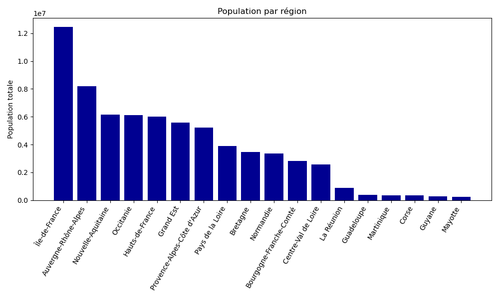

### 2.2 Tableaux et export Excel

Un tableau croisé avec `pandas.pivot_table` :

```python
tableau = communes.pivot_table(
    index="reg_nom", values="population", aggfunc=["count", "sum", "mean"]
)
```

Export vers un vrai classeur Excel avec `openpyxl` (installé, pas seulement `pandas.to_csv`) : plusieurs onglets, mise en forme des cellules, et même des **graphiques natifs Excel** (pas une image collée) :

```python
from openpyxl import Workbook
from openpyxl.chart import BarChart, Reference
from openpyxl.styles import Font

classeur = Workbook()
feuille = classeur.active
feuille.title = "Population par région"

par_region = communes.groupby("reg_nom")["population"].sum().sort_values(ascending=False)
feuille.append(["Région", "Population"])
feuille["A1"].font = feuille["B1"].font = Font(bold=True)
for region, population in par_region.items():
    feuille.append([region, int(population)])

graphique = BarChart()
graphique.title = "Population par région"
donnees = Reference(feuille, min_col=2, min_row=1, max_row=feuille.max_row)
categories = Reference(feuille, min_col=1, min_row=2, max_row=feuille.max_row)
graphique.add_data(donnees, titles_from_data=True)
graphique.set_categories(categories)
feuille.add_chart(graphique, "D2")

classeur.save(os.path.join(resultats, "rapport.xlsx"))
```

### 2.3 Rapports PDF multi-pages

`matplotlib.backends.backend_pdf.PdfPages` assemble plusieurs graphiques dans un seul PDF, une page par figure — pratique pour un rapport complet en une seule pièce jointe :

```python
from matplotlib.backends.backend_pdf import PdfPages

with PdfPages(os.path.join(resultats, "rapport.pdf")) as pdf:
    figure1, axe1 = plt.subplots()
    axe1.hist(communes["densite"].dropna(), bins=50)
    axe1.set_title("Distribution de la densité")
    pdf.savefig(figure1)
    plt.close(figure1)

    figure2, axe2 = plt.subplots()
    axe2.bar(par_region.index, par_region.values)
    axe2.set_title("Population par région")
    plt.xticks(rotation=60, ha="right")
    pdf.savefig(figure2, bbox_inches="tight")
    plt.close(figure2)
```

### 2.4 Cartographie

Pas de `geopandas`/`shapely` dans l'image d'exécution : la table `contours_departements` aplatit volontairement chaque polygone en points ordonnés (`dep_code`, `groupe`, `ordre`, `longitude`, `latitude`) plutôt qu'un format géospatial — `matplotlib.patches.Polygon` sait tracer un polygone à partir d'une simple liste de coordonnées, sans dépendance supplémentaire.

Le script d'exemple **`exemple_2.4_cartographie.py`** (déjà déposé et exécuté, résultat dans l'onglet **Suivi** ; téléchargeable dans `python/exemples/`) trace une carte choroplèthe de la population par département :

```python
from collections import defaultdict
from matplotlib.patches import Polygon
from matplotlib.collections import PatchCollection

contours = pd.read_sql(
    "SELECT dep_code, groupe, ordre, longitude, latitude FROM contours_departements ORDER BY dep_code, groupe, ordre",
    connexion,
)
polygones = defaultdict(list)
for ligne in contours.itertuples():
    polygones[(ligne.dep_code, ligne.groupe)].append((ligne.longitude, ligne.latitude))

patches = [Polygon(points, closed=True) for points in polygones.values()]
# ... couleur de chaque polygone selon la valeur de son département (cf. script complet) ...
collection = PatchCollection(patches, cmap="Blues")

figure, axe = plt.subplots(figsize=(8, 8))
axe.add_collection(collection)
axe.autoscale_view()
axe.set_aspect("equal")
axe.axis("off")
figure.savefig(os.path.join(resultats, "carte.png"), bbox_inches="tight")
```

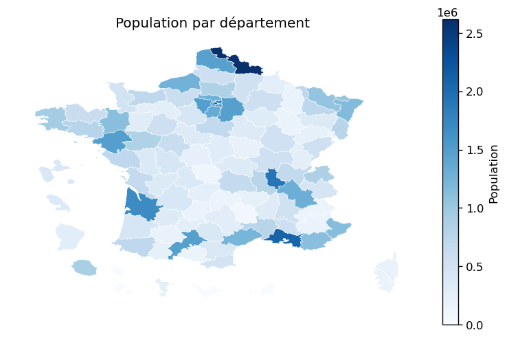

### Exercices

Corrigés téléchargeables dans `python/exercices/` (`exercice_2.1.py` à `exercice_2.4.py`).

**2.1.** Reproduisez la carte de `exemple_2.4_cartographie.py`, mais coloriée par **densité moyenne** du département plutôt que par population totale.

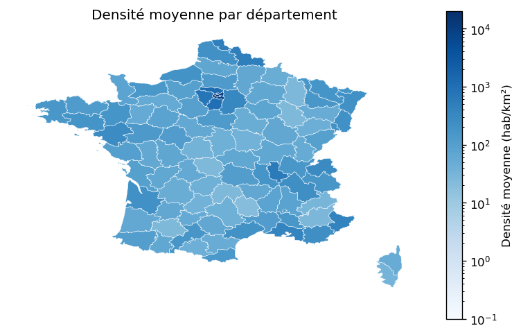

**2.2.** Exportez un fichier Excel avec un onglet par région, chacun listant les communes de la région triées par population, en utilisant `openpyxl` (indice : une feuille par valeur unique de `reg_nom`, via une boucle).

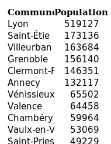

**2.3.** *Avancé* : assemblez en un seul PDF (`PdfPages`) trois graphiques de votre choix parmi ceux du panorama (2.1 ci-dessus).

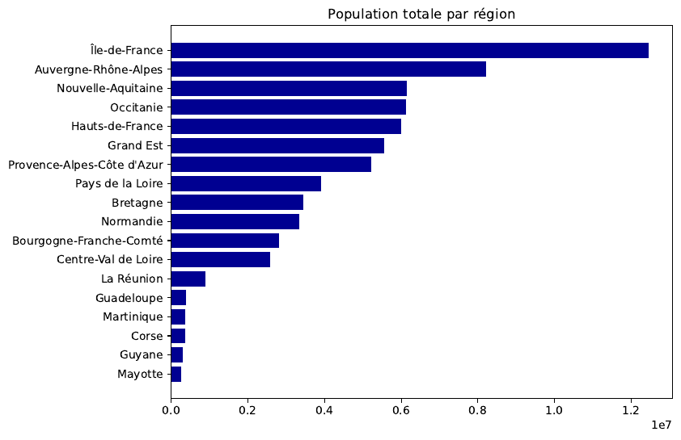

**2.4.** *Avancé* : calculez, pour chaque région, le coefficient de corrélation entre altitude moyenne et densité (`DataFrame.corr()` après un `groupby`). Les régions de montagne sont-elles significativement moins denses ?

Résultat réel (`correlation_altitude_densite.csv`, extrait) :

| Région | Corrélation |
|---|---|
| Île-de-France | -0,43 |
| Provence-Alpes-Côte d'Azur | -0,34 |
| Hauts-de-France | -0,30 |
| Bretagne | -0,26 |
| Corse | -0,23 |
| Bourgogne-Franche-Comté | -0,06 |

Corrélations négatives partout : dans chaque région, les communes les plus hautes en altitude tendent à être les moins denses — hypothèse confirmée, à des degrés très variables selon la région.

---

## Partie 3 — R avancé

Même contrat d'exécution qu'en Python (`SILLON_DSN`, `SILLON_RESULTATS`). Librairies R disponibles : `tidyverse` (dont `dplyr`, `ggplot2`, `tidyr`, `readr`), `DBI`, `RPostgreSQL`. **Pas de `jsonlite`, `sf` ni `openxlsx`** dans l'image d'exécution : contrairement à Python, R ne peut donc pas écrire de fichier Excel ici — seulement du CSV (`write.csv`) et des graphiques.

**Point d'attention** : `RPostgreSQL::dbConnect()` n'accepte pas directement la chaîne de connexion `SILLON_DSN` (format `clé=valeur` de libpq) — il faut l'analyser vous-même :

```r
library(DBI)
library(RPostgreSQL)
library(dplyr)
library(ggplot2)

analyser_dsn <- function(dsn) {
  valeurs <- list()
  for (paire in strsplit(trimws(dsn), "\\s+")[[1]]) {
    cle_valeur <- strsplit(paire, "=", fixed = TRUE)[[1]]
    valeurs[[cle_valeur[1]]] <- cle_valeur[2]
  }
  valeurs
}

parametres <- analyser_dsn(Sys.getenv("SILLON_DSN"))
resultats <- Sys.getenv("SILLON_RESULTATS")

connexion <- dbConnect(
  PostgreSQL(),
  host = parametres$host, port = as.integer(parametres$port),
  dbname = parametres$dbname, user = parametres$user, password = parametres$password
)
communes <- dbGetQuery(connexion, "SELECT * FROM communes_france")
```

### 3.1 Panorama des graphiques (ggplot2)

Toujours la même grammaire : `ggplot(donnees, aes(...)) + geom_...() + ...`.

| Graphique | Géométrie | Usage typique |
|---|---|---|
| Courbe | `geom_line()` | évolution le long d'une variable continue |
| Barres | `geom_col()` (valeurs déjà agrégées) / `geom_bar()` (comptage) | comparaison de catégories |
| Nuage de points | `geom_point()` | relation entre deux variables |
| Histogramme | `geom_histogram()` | distribution d'une variable |
| Boîte à moustaches | `geom_boxplot()` | comparer la dispersion entre groupes |
| Plusieurs graphiques | `facet_wrap(~ variable)` | un panneau par catégorie, échelle commune |

```r
graphique <- ggplot(communes, aes(x = densite)) +
  geom_histogram(bins = 50, fill = "#000091") +
  scale_x_log10() +
  facet_wrap(~ reg_nom) +  # un histogramme par région
  theme_minimal()
ggsave(file.path(resultats, "densite_par_region.png"), graphique, width = 10, height = 8)
```

Le script d'exemple **`exemple_3.1_panorama_graphiques.R`** (déjà exécuté, résultat dans l'onglet **Suivi** ; téléchargeable dans `r/exemples/`) trace la densité moyenne des 15 départements les plus denses et la relation altitude/densité.

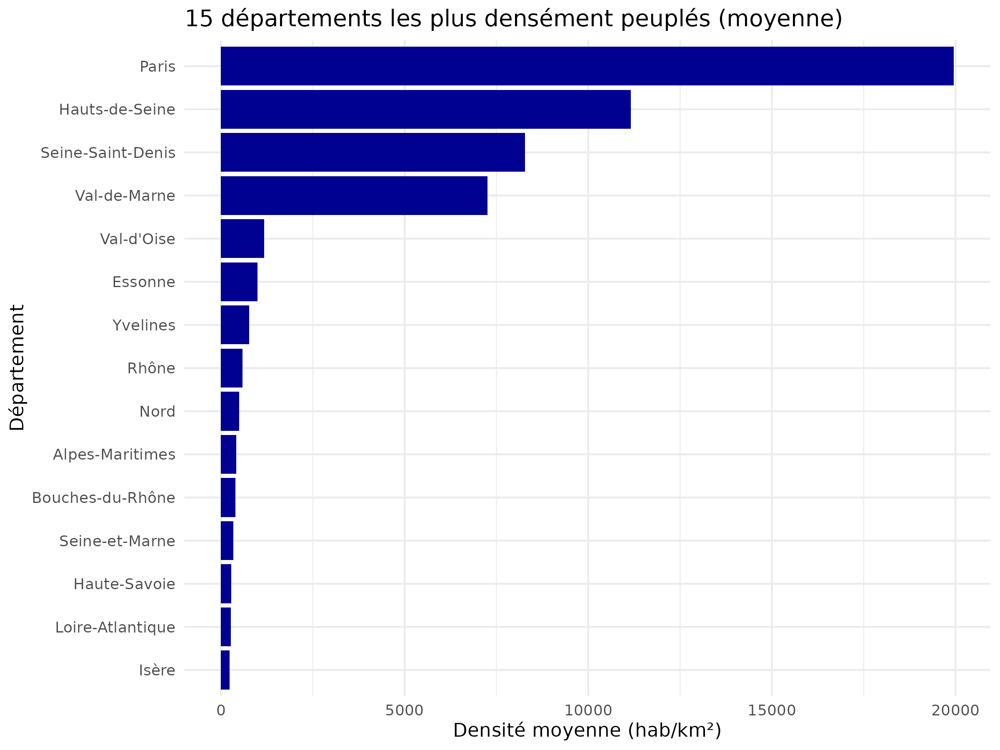

### 3.2 Tableaux

```r
tableau <- communes %>%
  group_by(reg_nom) %>%
  summarise(nb_communes = n(), population_totale = sum(population), densite_moyenne = mean(densite, na.rm = TRUE)) %>%
  arrange(desc(population_totale))

write.csv(tableau, file.path(resultats, "tableau_regions.csv"), row.names = FALSE)
```

### 3.3 Rapports PDF multi-pages

Le périphérique graphique `pdf()` de R (toujours disponible, aucun package requis) écrit une nouvelle page à chaque graphique tracé entre son ouverture et `dev.off()` :

```r
pdf(file.path(resultats, "rapport.pdf"), width = 8, height = 6)

hist(communes$densite, breaks = 50, main = "Distribution de la densité")

par_region <- communes %>% group_by(reg_nom) %>% summarise(population_totale = sum(population))
barplot(par_region$population_totale, names.arg = par_region$reg_nom, las = 2,
        main = "Population par région")

dev.off()
```

### 3.4 Cartographie

Sans `sf` ni `maps` dans l'image d'exécution : `geom_polygon()` de ggplot2 sait tracer un polygone directement à partir d'un data frame de points ordonnés (colonnes `x`, `y`, `group`) — le style « fortifié » classique de ggplot2, sans dépendance géospatiale.

Le script d'exemple **`exemple_3.4_cartographie.R`** (déjà déposé et exécuté, résultat dans l'onglet **Suivi** ; téléchargeable dans `r/exemples/`) trace la même carte choroplèthe qu'en Python :

```r
contours <- dbGetQuery(
  connexion,
  "SELECT dep_code, groupe, ordre, longitude, latitude FROM contours_departements ORDER BY dep_code, groupe, ordre"
)
population_par_dep <- dbGetQuery(
  connexion, "SELECT dep_code, SUM(population) AS population_totale FROM communes_france GROUP BY dep_code"
)

contours <- contours %>%
  mutate(id_polygone = paste(dep_code, groupe, sep = "_")) %>%
  left_join(population_par_dep, by = "dep_code")

carte <- ggplot(contours, aes(x = longitude, y = latitude, group = id_polygone, fill = population_totale)) +
  geom_polygon(color = "white", linewidth = 0.1) +
  coord_fixed() +
  scale_fill_gradient(low = "#e8edfb", high = "#000091") +
  theme_void()
ggsave(file.path(resultats, "carte.png"), carte, width = 8, height = 8)
```

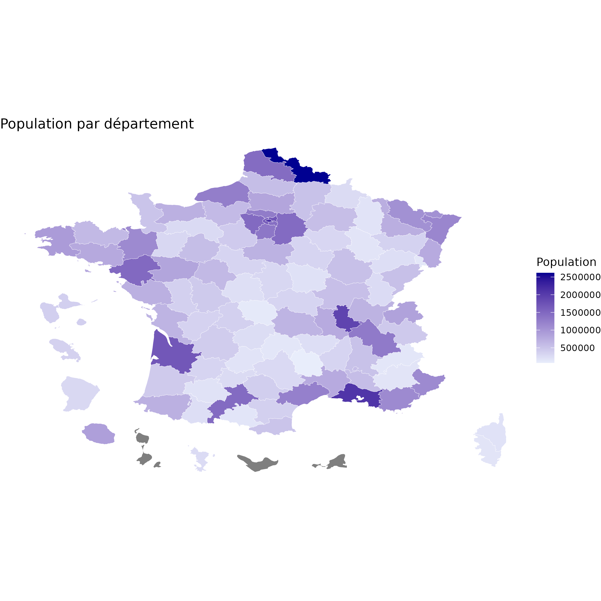

### Exercices

Corrigés téléchargeables dans `r/exercices/` (`exercice_3.1.R` à `exercice_3.4.R`).

**3.1.** Reproduisez la carte de `exemple_3.4_cartographie.R`, mais coloriée par densité moyenne plutôt que par population totale (indice : comparez à l'exercice Python 2.1).

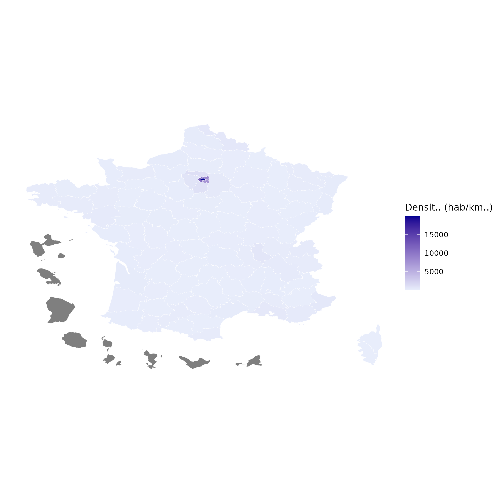

**3.2.** Avec `facet_wrap`, tracez un histogramme de la population des communes, un panneau par région.

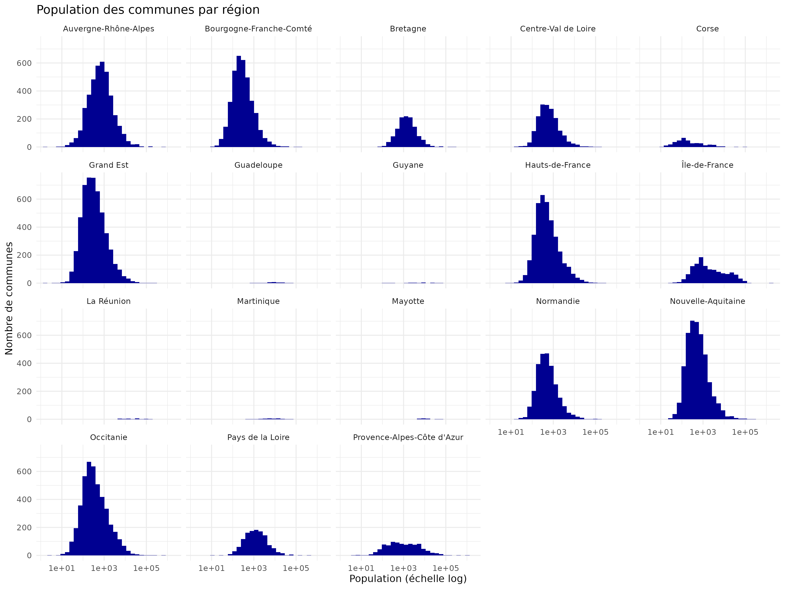

**3.3.** *Avancé* : à l'aide de `regions_france`, faites une jointure (`inner_join`) entre les deux tables pour comparer, région par région, la population du chef-lieu à la population totale de la région — comme l'exercice SQL 6.2, mais en R.

Résultat réel (`part_chef_lieu.csv`, 5 premières lignes sur 18 régions) :

| Chef-lieu | Région | Population du chef-lieu | Population totale | Part |
|---|---|---|---|---|
| Mamoudzou | Mayotte | 71 437 | 256 518 | 27,8 % |
| Ajaccio | Corse | 76 320 | 355 486 | 21,5 % |
| Cayenne | Guyane | 62 675 | 293 996 | 21,3 % |
| Fort-de-France | Martinique | 75 506 | 360 630 | 20,9 % |
| Paris | Île-de-France | 2 103 778 | 12 463 067 | 16,9 % |

Sans surprise, les chefs-lieux des petites régions ultramarines pèsent nettement plus lourd dans leur région que les grandes métropoles métropolitaines (Lyon : 6,3 %, Lille : 4 %) dans la leur.

**3.4.** *Avancé* : assemblez trois graphiques dans un seul rapport PDF avec `pdf()`/`dev.off()`.

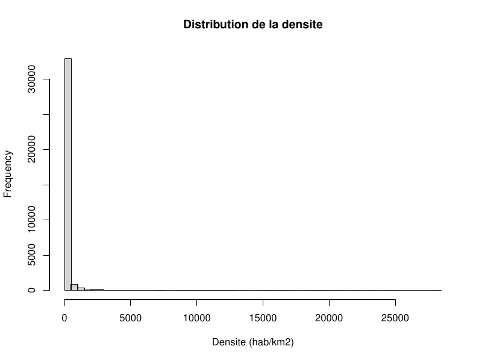

---

## Partie 4 — Python à grande échelle (`sillon-demo-sirene`)

Le paquet optionnel `sillon-demo-sirene` (complémentaire de `sillon-tutoriel`, à installer séparément — voir le guide d'installation administrateur, §7.2) importe le jeu de données Sirene complet de l'INSEE (« StockEtablissement », Licence Ouverte 2.0, [data.gouv.fr](https://www.data.gouv.fr/)) dans la même base partagée du tutoriel : la table **`sirene_etablissements`**, environ **43,9 millions de lignes** — un ordre de grandeur au-delà de `communes_france`. Six scripts Python et trois scripts R, déjà déposés et exécutés à l'installation de ce paquet, démontrent les mêmes possibilités que les Parties 2 et 3 mais à cette échelle. **Si ce paquet n'est pas installé, cette table n'existe pas** : passez directement à « Pour continuer ».

**Règle impérative à cette échelle** : chaque script agrège côté PostgreSQL (`GROUP BY`, `COUNT`, ...) avant de rapatrier le résultat en Python/R — jamais un `SELECT * FROM sirene_etablissements` ni un `pd.read_sql("SELECT * FROM ...")` sans filtre, qui dépasserait largement le quota mémoire du conteneur d'exécution (`ram_max_conteneur_mo`, §11 du cahier des charges). Une requête déjà réduite à quelques dizaines ou centaines de lignes transite seule vers pandas/dplyr. Même sous cette forme agrégée, chaque requête balaie l'essentiel des 43,9 millions de lignes — la table n'est indexée qu'en recherche approchée (`GIN`/trigramme, pour un filtrage par motif), pas pour ce type de regroupement : comptez couramment plusieurs minutes par script.

Colonnes de `sirene_etablissements` : `siren`, `siret`, `date_creation`, `tranche_effectifs`, `etablissement_siege` (booléen), `dep_code` (croisable avec `communes_france`/`contours_departements`), `etat_administratif` (`A` = actif), `activite_principale` (code NAF), `caractere_employeur` — volontairement réduit aux colonnes utilisées par les scripts de démonstration (chaque colonne Texte ajoute un index de recherche approchée coûteux en espace disque à la construction, §7.4).

Scripts téléchargeables dans `python/` et `r/` (archive `corriges-sirene.zip`, modale « À propos »).

### 4.1 Panorama des graphiques (`graphiques_couverture.py`)

Quatre graphiques dans une seule image (`plt.subplots(2, 2)`), chacun à partir d'une requête agrégée séparée : barres (établissements actifs par tranche d'effectif), camembert (part des employeurs), courbe (créations par année depuis 1990), barres horizontales (15 divisions NAF les plus représentées, à partir des deux premiers caractères du code d'activité principale).

```python
par_tranche = pd.read_sql("""
    SELECT COALESCE(NULLIF(tranche_effectifs, ''), 'Non renseigné') AS tranche, COUNT(*) AS nb
    FROM sirene_etablissements WHERE etat_administratif = 'A'
    GROUP BY tranche ORDER BY tranche
""", connexion)
# ... trois requêtes agrégées supplémentaires (camembert, courbe, barres horizontales) ...

figure, axes = plt.subplots(2, 2, figsize=(13, 10))
axes[0, 0].bar(par_tranche["tranche"], par_tranche["nb"], color="#000091")
axes[0, 1].pie(par_caractere_employeur["nb"], labels=par_caractere_employeur["categorie"], autopct="%1.1f%%")
axes[1, 0].plot(creations_par_annee["annee"], creations_par_annee["nb"], color="#e1000f", marker=".")
axes[1, 1].barh(top_secteurs["division_naf"][::-1], top_secteurs["nb"][::-1], color="#000091")
```

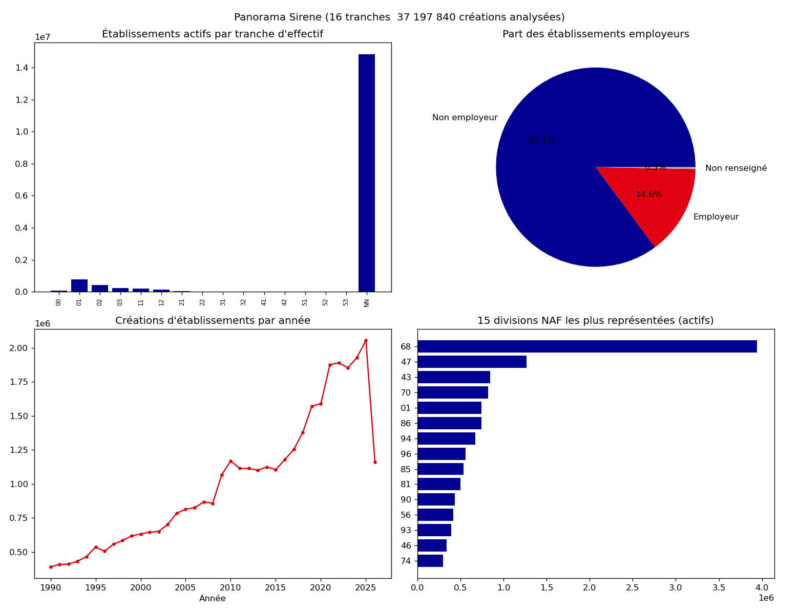

### 4.2 Tableau croisé (`tableau_pandas.py`)

Tableau croisé `pandas.pivot_table` (départements × tranches d'effectif, restreint aux 12 départements comptant le plus d'établissements actifs via une sous-requête), exporté en CSV et en image de tableau (`ax.table`) — utile quand le résultat doit être consulté sans tableur.

```python
tableau = pd.pivot_table(brut, index="dep_code", columns="tranche", values="nb", aggfunc="sum", fill_value=0)
tableau["total"] = tableau.sum(axis=1)
tableau = tableau.sort_values("total", ascending=False)
tableau.to_csv(os.path.join(resultats, "tableau_croise_departements.csv"))
```

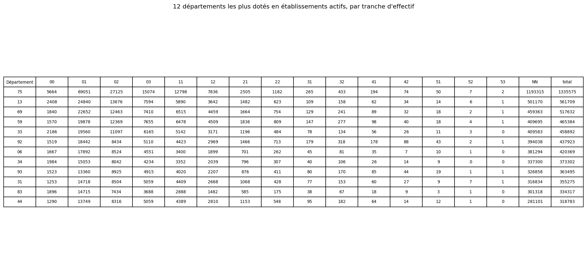

### 4.3 Export Excel avec graphique natif (`export_excel.py`)

Classeur `openpyxl` à trois feuilles (résumé, top 20 secteurs NAF, par département), avec un graphique natif Excel (`openpyxl.chart.BarChart`) directement modifiable dans Excel ou LibreOffice — pas une simple image collée.

```python
graphique = BarChart()
graphique.title = "20 divisions NAF les plus représentées (actifs)"
donnees = Reference(feuille_secteurs, min_col=2, min_row=1, max_row=1 + len(top_secteurs))
categories = Reference(feuille_secteurs, min_col=1, min_row=2, max_row=1 + len(top_secteurs))
graphique.add_data(donnees, titles_from_data=True)
graphique.set_categories(categories)
feuille_secteurs.add_chart(graphique, "E2")
```

Résultat réel (`sirene_synthese.xlsx`, feuille « Résumé ») :

| Indicateur | Valeur |
|---|---|
| Établissements (total) | 43 896 818 |
| Établissements actifs | 16 715 258 |
| Sièges actifs | 29 900 801 |

### 4.4 Rapport PDF multi-pages (`rapport_pdf_multipages.py`)

`PdfPages` assemble une page de garde (texte seul, `figure.text(...)` sans axes) et deux graphiques (évolution des créations depuis 2000, 10 départements les plus dotés en établissements actifs) en un seul PDF.

```python
with PdfPages(chemin_pdf) as pdf:
    figure_garde = plt.figure(figsize=(8.27, 11.69))  # A4 portrait
    figure_garde.text(0.5, 0.6, "Rapport Sirene", ha="center", fontsize=28, weight="bold")
    pdf.savefig(figure_garde)
    plt.close(figure_garde)
    # ... une figure par page suivante, pdf.savefig() à chaque fois ...
```

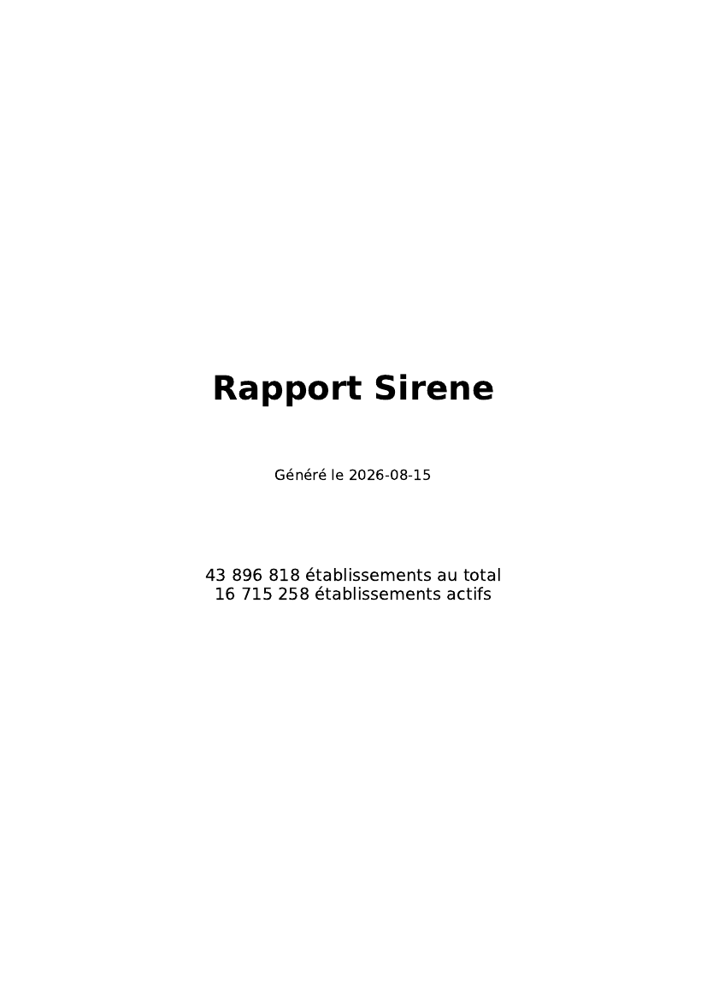

### 4.5 Diagramme Mermaid (`diagramme_mermaid.py`)

Le bac à sable n'a ni Node.js ni Chromium (§7.7/§8.7 du cahier des charges) : impossible d'y rendre une image Mermaid. Le script se contente d'écrire le **texte** Mermaid (`pie showData title ...`) dans ses résultats — SILLON le rend lui-même, côté navigateur, dès que vous ouvrez le bouton **« Aperçus »** du job dans l'onglet Suivi (à côté de « Journal » et « Télécharger »). Aucune bibliothèque supplémentaire requise, en Python comme en R : même principe repris en 5.3.

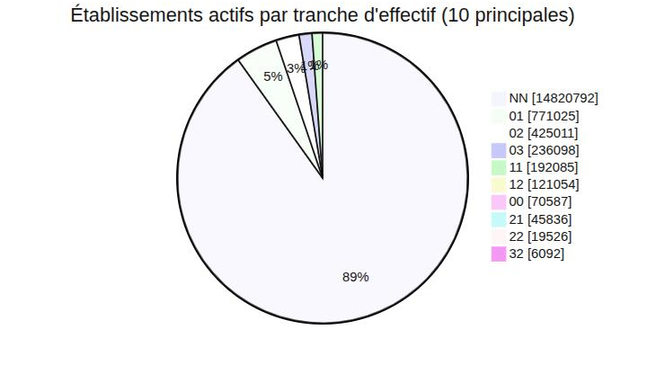

### 4.6 Cartographie croisée (`carte_choroplethe.py`)

Densité d'établissements actifs par département, sur les contours réels déjà importés par `sillon-tutoriel` (`contours_departements`) — les deux paquets partagent la même base partagée du tutoriel, cette jointure ne nécessite donc aucun import supplémentaire. Échelle **logarithmique** (`LogNorm`), pas linéaire : le nombre d'établissements par département est extrêmement asymétrique (Paris et les départements franciliens en concentrent bien plus que les départements ruraux) — une échelle linéaire écraserait la plupart des départements dans la teinte la plus claire, tous indiscernables (même défaut, et même corrigé, que la densité de population en Partie 2, exercice 2.1).

```python
collection = PatchCollection(
    patches, array=couleurs, cmap=cm.get_cmap("Reds"),
    norm=mcolors.LogNorm(vmin=max(min(couleurs), 1), vmax=max(couleurs)),
    edgecolor="white", linewidth=0.3,
)
```

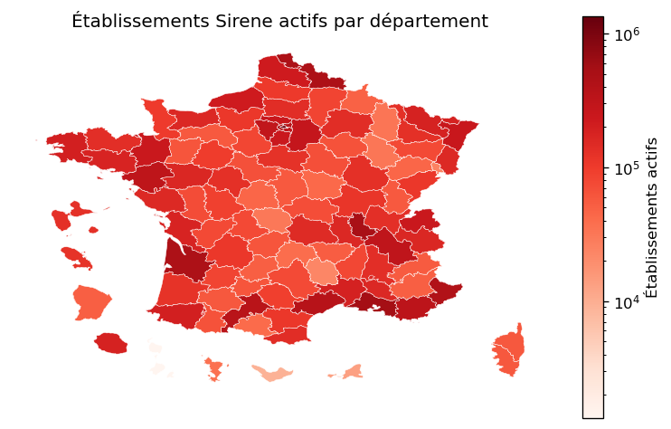

---

## Partie 5 — R à grande échelle (`sillon-demo-sirene`)

Même jeu de données et même règle d'agrégation SQL qu'en Partie 4.

### 5.1 Panorama des graphiques (`graphiques_ggplot.R`)

Trois graphiques ggplot2 à partir de requêtes agrégées : barres (par tranche d'effectif), courbe (créations par année depuis 1990), histogramme (distribution du nombre d'établissements actifs par département). Comme pour la carte Python de la Partie 4, l'histogramme passe en échelle logarithmique (`scale_x_log10()`) — la distribution par département est trop asymétrique pour des tranches linéaires lisibles.

```r
graphique_departements <- ggplot(par_departement, aes(x = nb)) +
  geom_histogram(bins = 30, fill = "#000091") +
  scale_x_log10() +
  theme_minimal() +
  labs(title = "Distribution du nombre d'établissements actifs par département",
       x = "Établissements actifs par département (échelle log)", y = "Nombre de départements")
```

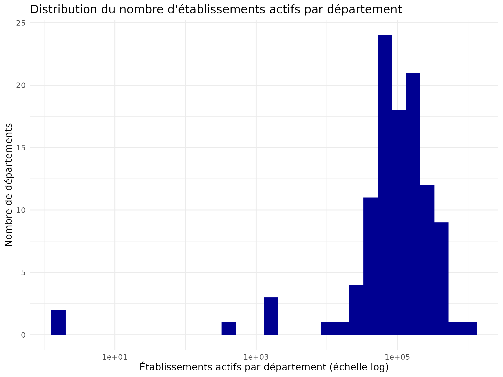

### 5.2 Pipeline dplyr (`analyse_dplyr.R`)

Classement des divisions NAF les plus représentées parmi les établissements actifs (`mutate`/`arrange`/`row_number` sur un résultat déjà agrégé côté SQL), exporté en CSV.

```r
classement <- par_secteur %>%
  mutate(part_pct = round(100 * nb / sum(nb), 2)) %>%
  arrange(desc(nb)) %>%
  mutate(rang = row_number()) %>%
  select(rang, division_naf, nb, part_pct) %>%
  head(20)
```

Résultat réel (`classement_secteurs_naf.csv`, 5 premières lignes sur 87 divisions NAF) :

| Rang | Division NAF | Établissements actifs | Part |
|---|---|---|---|
| 1 | 68 | 3 944 704 | 23,6 % |
| 2 | 47 | 1 265 511 | 7,57 % |
| 3 | 43 | 848 346 | 5,08 % |
| 4 | 70 | 821 505 | 4,91 % |
| 5 | 01 | 747 583 | 4,47 % |

La division 68 (« Activités immobilières ») domine largement — attendu pour un fichier d'établissements actifs plutôt que d'emplois : chaque logement loué par un particulier via une société civile immobilière y compte comme un établissement à part entière.

### 5.3 Diagramme Mermaid (`diagramme_mermaid.R`)

Même principe qu'en 4.5 : le script écrit le texte Mermaid (répartition employeurs/non-employeurs parmi les établissements actifs), rendu côté navigateur depuis l'onglet Suivi.

```r
lignes <- c("pie showData title Établissements actifs, employeurs ou non")
for (i in seq_len(nrow(par_caractere))) {
  lignes <- c(lignes, sprintf('    "%s" : %d', par_caractere$categorie[i], par_caractere$nb[i]))
}
writeLines(lignes, file.path(resultats, "repartition_employeurs.mmd"))
```

---

## Pour continuer

- Les onglets **Bases**, **Import** et **Suivi** couvrent le reste des fonctionnalités de SILLON : import de vos propres fichiers CSV, partage de base avec un autre compte, suivi et annulation des traitements en cours.
- Le **Guide d'installation administrateur** (accessible depuis le bouton « À propos ») détaille la configuration du serveur, les quotas et les procédures de désinstallation.
- Ce compte de démonstration peut être réinitialisé à tout moment : `sudo apt-get purge sillon-tutoriel && sudo apt-get install sillon-tutoriel` (voir le guide d'installation administrateur, §7.2 et §8).
- Si `sillon-demo-sirene` (Parties 4 et 5) n'est pas encore installé, il s'ajoute sans toucher au reste : `sudo dpkg -i sillon-demo-sirene_0.1.0_all.deb` (nécessite un accès Internet sur la machine cible le temps de l'installation — voir le guide d'installation administrateur, §7.2).
